# Py2.2 variables
One of the most powerful features of a programming language is the ability to manipulate **variables**. A variable is a name that refers to a value.

The **assignment statement** gives a value to a variable:
```
>>> message = "What’s up, Doc?"
>>> n = 17
>>> pi = 3.14159
```
This example makes three assignments. The first assigns the string value "What’s up, Doc?" to a variable named message. The second gives the integer 17 to n, and the third assigns the floating-point number 3.14159 to a variable called pi.

The **assignment token**, =, should not be confused with equals, which uses the token ==. The assignment statement binds a name, on the left-hand side of the operator, to a value, on the right-hand side. This is why you will get an error if you enter:
```
>>> 17 = n 
File "<interactive input>", line 1 
SyntaxError: can’t assign to literal
```
---- 
Tip: When reading or writing code, say to yourself “n is assigned 17” or “n gets the value 17”. Don’t say “n equals 17”.
---- 
A common way to represent variables on paper is to write the name with an arrow pointing to the variable’s value. This kind of figure is called a **state snapshot** because it shows what state each of the variables is in at a particular instant in time. (Think of it as the variable’s state of mind). This diagram shows the result of executing the assignment statements:

If you ask the interpreter to evaluate a variable, it will produce the value that is currently linked to the variable:
```
>>> message 
’What’s up, Doc?’
>>> n 
17
>>> pi
3.14159
```
We use variables in a program to “remember” things, perhaps the current score at the football game. But variables are variable. This means they can change over time, just like the scoreboard at a football game. You can assign a value to a variable, and later assign a different value to the same variable. (This is different from maths. In maths, if you give ‘x‘ the value 3, it cannot change to link to a different value half-way through your calculations!)
```
>>> day = "Thursday"
>>> day ’Thursday’
>>> day = "Friday"
>>> day ’Friday’
>>> day = 21
>>> day 
21
```
You’ll notice we changed the value of day three times, and on the third assignment we even made it refer to a value that was of a different type.

A great deal of programming is about having the computer remember things, e.g. The number of missed calls on your phone, and then arranging to update or change the variable when you miss another call.

# code/python

# Learning Python
[Py1: The way of the program](ulysses://x-callback-url/open?id=gQEVJqyryVIFSE_NrUGlgg)
[Py2: variables, expressions and statements](ulysses://x-callback-url/open?id=7zuXulMKE05FIKO3jpitow)
[Py3: Our first turtle program](ulysses://x-callback-url/open?id=M6rCLBX-0HZR5IwTwltYJg)
[Py4: functions](#)
[Py5: Conditionals](#)
[Py6: Fruitful functions](#)
[Py7: Iteration](#)
[Py8: Strings](#)
[Py9: tuples](#)
[Py10: event-driven programming](#)
[Py11: lists](#)
[Py12: Modules](#)
[Py13: files](#)
[Py14: List algorithms](#)
[Py15: Classes and objects - the Basics](#)
[Py16: Classes and objects - Digging a little deeper](#)
[Py17: PyGame](#)
[Py18: Recursion](#)
[Py19: Exceptions](#)
[Py20: Dictionaries](#)
[Py21: even more OOP](#)
[Py22: collections of objects](#)
[Py23: Inheritance](#)
[Py24: linked lists](#)
[Py25: stacks](#)
[Py26: queues](#)
[Py27: trees](#)
[PyA: debugging](#)
[PyB: an odds-and-ends workbook](#)
[PyC: configuring Ubuntu for Python Development](#)
[PyD: customizing and contributing to the Book](#)
[PyE: some tips, tricks, and common errors](#)
[PyF: GNU Free Documentation License](#)


Copyright Notice

Copyright (C) Peter Wentworth, Jeffrey Elkner, Allen B. Downey and Chris Meyers. Permission is granted to copy, distribute and/or modify this document under the terms of the GNU Free Documentation License, Version 1.3 or any later version published by the Free Software Foundation; with Invariant Sections being Foreword, Preface, and Contributor List, no Front-Cover Texts, and no Back-Cover Texts. A copy of the license is included in the section entitled “GNU Free Documentation License”.

# code/python

## Py1 The way of the program
# Py1: The way of the program
The goal of this book is to teach you to think like a computer scientist. This way of thinking combines some of the best features of mathematics, engineering, and natural science. Like **mathematicians**, computer scientists use formal languages to denote ideas (specifically computations). Like **engineers**, they design things, assembling components into systems and evaluating tradeoffs among alternatives. Like **scientists**, they observe the behavior of complex systems, form hypotheses, and test predictions.

The single most important skill for a computer scientist is **problem solving.** Problem solving means the ability to formulate problems, think creatively about solutions, and express a solution clearly and accurately. As it turns out, the process of learning to program is an excellent opportunity to practice problem-solving skills. That’s why this chapter is called, The way of the program.

On one level, you will be learning to program, a useful skill by itself. On another level, you will use programming as a means to an end. As we go along, that end will become clearer.

[Py1.1 The Python programming language](ulysses://x-callback-url/open?id=UcCq8gfMxIqRbOQpxoiR6g)
[Py1.2 What is a program?](ulysses://x-callback-url/open?id=fF-swQRmHjM96DUUI_Whow)
[Py1.3 What is debugging?](ulysses://x-callback-url/open?id=BceWzoZcrvvCtbwY_E8qcA)
[Py1.4 syntax errors](ulysses://x-callback-url/open?id=AoQ1Q0nKwDg3CqCIjG4n7A)
[Py1.5 runtime errors](ulysses://x-callback-url/open?id=k8tmn7-3uvXy-MSrBT4qVQ)
[Py1.6 semantic errors](ulysses://x-callback-url/open?id=4LohJKb3PfC7UavFRcAduA)
[Py1.7 Experimental debugging](ulysses://x-callback-url/open?id=2_gWQkzFc7tcO2nXxkMWvg)
[Py1.8 Formal and natural languages](ulysses://x-callback-url/open?id=hqmsXJp2BAMP6TVSgCLSKg)
[Py1.9 the first program](ulysses://x-callback-url/open?id=GSyf199vp_rBKEYEwk8PlQ)
[Py1.10 Comments](ulysses://x-callback-url/open?id=G9GxLvt7X3acjycQ1mp5EQ)
[Py1.12 Exercises](ulysses://x-callback-url/open?id=i8VGg-MYP38UQFlfV01Z5w)


# code/python

# Py1.1 The Python programming language
The programming language you will be learning is Python. Python is an example of a **high-level language**; other high-level languages you might have heard of are C
As you might infer from the name high-level language, there are also low-level languages, sometimes referred to as machine languages or assembly languages. Loosely speaking, computers can only execute programs written in low-level languages. Thus, programs written in a high-level language have to be translated into something more suitable before they can run.

Almost all programs are written in high-level languages because of their advantages. It is ~much easier to program~ in a high-level language so programs take less time to write, they are shorter and easier to read, and they are more likely to be correct. Second, high-level languages are ~portable~, meaning that they can run on different kinds of computers with few or no modifications.

The engine that translates and runs Python is called the **Python Interpreter**: There are two ways to use it: ~immediate mode~ and ~script mode~. In immediate mode, you type Python expressions into the Python Interpreter window, and the interpreter immediately shows the result:


The **\>\>\>** is called the ~Python prompt~. The interpreter uses the prompt to indicate that it is ready for instructions. We typed 2 + 2, and the interpreter evaluated our expression, and replied 4, and on the next line it gave a new prompt, indicating that it is ready for more input.

Alternatively, you can write a program in a file and use the interpreter to execute the contents of the file. Such a file is called a script. Scripts have the advantage that they can be saved to disk, printed, and so on.

In this Rhodes Local Edition of the textbook, we use a program development environment called PyScripter. (It is available at http://code.google.com/p/pyscripter.) There are various other development environments. If you’re using one of the others, you might be better off working with the authors’ original book rather than this edition.

For example, we created a file named firstprogram.py using PyScripter. By convention, files that contain Python programs have names that end with .py

To execute the program, we can click the Run button in PyScripter:

Most programs are more interesting than this one.

Working directly in the interpreter is convenient for testing short bits of code because you get immediate feedback. Think of it as scratch paper used to help you work out problems. Anything longer than a few lines should be put into a script.

# code/python

# Py1.2 What is a program?
A program is a sequence of instructions that specifies how to perform a computation. The computation might be something mathematical, such as solving a system of equations or finding the roots of a polynomial, but it can also be a symbolic computation, such as searching and replacing text in a document or (strangely enough) compiling a program.

The details look different in different languages, but a few basic instructions appear in just about every language:

- **input** Get data from the keyboard, a file, or some other device.
- **output** Display data on the screen or send data to a file or other device.
- **math** Perform basic mathematical operations like addition and multiplication.
- **conditional execution** Check for certain conditions and execute the appropriate sequence of statements.
- **repetition** Perform some action repeatedly, usually with some variation.

Believe it or not, that’s pretty much all there is to it. Every program you’ve ever used, no matter how complicated, is made up of instructions that look more or less like these. Thus, we can describe programming as the process of breaking a large, complex task into smaller and smaller subtasks until the subtasks are simple enough to be performed with sequences of these basic instructions.

That may be a little vague, but we will come back to this topic later when we talk about algorithms.

# code/python

# Py1.3 What is debugging?
Programming is a complex process, and because it is done by human beings, it often leads to errors. Programming errors are called bugs and the process of tracking them down and correcting them is called debugging. Use of the term bug to describe small engineering difficulties dates back to at least 1889, when Thomas Edison had a bug with his phonograph.

**Three kinds of errors** can occur in a program: [[Py1.4 syntax errors]], [[Py1.5 runtime errors]], and [[Py1.6 semantic errors]]. It is useful to distinguish between them in order to track them down more quickly.

# code/python

# Py1.4 syntax errors
Python can only execute a program if the program is syntactically correct; otherwise, the process fails and returns an error message. Syntax refers to the ~structure of a program and the rules about that structure~. For example, in English, a sentence must begin with a capital letter and end with a period. this sentence contains a syntax error. So does this one

For most readers, a few syntax errors are not a significant problem, which is why we can read the poetry of E. E. Cummings without problems. Python is not so forgiving. If there is a single syntax error anywhere in your program, Python will display an error message and quit, and you will not be able to run your program. During the first few weeks of your programming career, you will probably spend a lot of time tracking down syntax errors. As you gain experience, though, you will make fewer errors and find them faster.

# code/python

# Py1.5 runtime errors
The second type of error is a runtime error, so called because the error does ~not appear until you run the program~. These errors are also called **exceptions** because they usually indicate that something exceptional (and bad) has happened.

Runtime errors are rare in the simple programs you will see in the first few chapters, so it might be a while before you encounter one.

# code/python

# Py1.6 semantic errors
The third type of error is the semantic error. If there is a semantic error in your program, it will **run successfully**, in the sense that the computer will not generate any error messages, but it will not do the right thing. It will do something else. Specifically, it will do what you told it to do.

The problem is that the program you wrote is not the program you wanted to write. The meaning of the program (its semantics) is wrong. Identifying semantic errors can be tricky because it requires you to work backward by looking at the output of the program and trying to figure out what it is doing.

# code/python

# Py1.7 Experimental debugging
One of the most important skills you will acquire is debugging. Although it can be frustrating, debugging is one of the most intellectually rich, challenging, and interesting parts of programming.

In some ways, debugging is like detective work. You are confronted with clues, and you have to infer the processes and events that led to the results you see.

Debugging is also like an experimental science. Once you have an idea what is going wrong, you modify your program and try again. If your hypothesis was correct, then you can predict the result of the modification, and you take a step closer to a working program. If your hypothesis was wrong, you have to come up with a new one. As Sherlock Holmes pointed out, ~When you have eliminated the impossible, whatever remains, however improbable, must be the truth.~ (A. Conan Doyle, The Sign of Four)

For some people, programming and debugging are the same thing. That is, programming is the process of gradually debugging a program until it does what you want. The idea is that you should start with a program that does something and make small modifications, debugging them as you go, so that you always have a working program.

For example, Linux is an operating system kernel that contains millions of lines of code, but it started out as a simple program Linus Torvalds used to explore the Intel 80386 chip. According to Larry Greenfield, one of Linus’s earlier projects was a program that would switch between displaying AAAA and BBBB. This later evolved to Linux (The Linux Users’ Guide Beta Version 1).

Later chapters will make more suggestions about debugging and other programming practices.

# code/python

# Py1.8 Formal and natural languages
**Natural languages** are the languages that people speak, such as English, Spanish, and French. They were not designed by people (although people try to impose some order on them); they ~evolved naturally.~

**Formal languages** are languages that are designed by people for specific applications. For example, the notation that mathematicians use is a formal language that is particularly good at denoting relationships among numbers and symbols. Chemists use a formal language to represent the chemical structure of molecules. And most importantly:

> Programming languages are formal languages that have been designed to express computations.  
> 
Formal languages tend to have strict rules about syntax. For example, 3+3=6 is a syntactically correct mathematical statement, but 3=+6$ is not. H 2 O is a syntactically correct chemical name, but 2 Zz is not.

Syntax rules come in two flavors, pertaining to **tokens** and structure. **Tokens** are the ~basic elements of the language~, such as words, numbers, parentheses, commas, and so on. In Python, a statement like print("Happy New Year for ",2013) has 6 tokens: a function name, an open parenthesis (round bracket), a string, a comma, a number, and a close parenthesis.

It is possible to make errors in the way one constructs tokens. One of the problems with 3=+6$ is that $ is not a legal token in mathematics (at least as far as we know). Similarly, 2 Zz is not a legal token in chemistry notation because there is no element with the abbreviation Zz.

The second type of syntax rule pertains to the **structure** of a statement— that is, ~the way the tokens are arranged~. The statement 3=+6$ is structurally illegal because you can’t place a plus sign immediately after an equal sign. Similarly, molecular formulas have to have subscripts after the element name, not before. And in our Python example, if we omitted the comma, or if we changed the two parentheses around to say print)"Happy New Year for ",2013( our statement would still have six legal and valid tokens, but the structure is illegal.

When you read a sentence in English or a statement in a formal language, you have to figure out what the structure of the sentence is (although in a natural language you do this subconsciously). This process is called **parsing**.

For example, when you hear the sentence, “The other shoe fell”, you understand that the other shoe is the subject and fell is the verb. Once you have parsed a sentence, you can figure out what it means, or the semantics of the sentence. Assuming that you know what a shoe is and what it means to fall, you will understand the general implication of this sentence.
---- 
Although formal and natural languages have many features in common — tokens, structure, syntax, and semantics — there are many differences:

```
- **ambiguity** Natural languages are full of ambiguity, which people deal with by using contextual clues and other information. Formal languages are designed to be nearly or completely unambiguous, which means that any statement has exactly one meaning, regardless of context.
- **redundancy** In order to make up for ambiguity and reduce misunderstandings, natural languages employ lots of redundancy. As a result, they are often verbose. Formal languages are less redundant and more concise.
- **literalness** Formal languages mean exactly what they say. On the other hand, natural languages are full of idiom and metaphor. If someone says, “The other shoe fell”, there is probably no shoe and nothing falling. You’ll need to find the original joke to understand the idiomatic meaning of the other shoe falling. Yahoo! Answers thinks it knows!
```

People who grow up speaking a natural language—everyone—often have a hard time adjusting to formal languages. In some ways, the difference between formal and natural language is like the difference between poetry and prose, but more so:

```
- **poetry** Words are used for their sounds as well as for their meaning, and the whole poem together creates an effect or emotional response. Ambiguity is not only common but often deliberate.
- **prose** The literal meaning of words is more important, and the structure contributes more meaning. Prose is more amenable to analysis than poetry but still often ambiguous. 
- **program** The meaning of a computer program is unambiguous and literal, and can be understood entirely by analysis of the ~tokens~ and ~structure~.
```

Here are some suggestions for reading programs (and other formal languages). First, remember that formal languages are much more dense than natural languages, so it takes longer to read them. Also, the structure is very important, so it is usually not a good idea to read from top to bottom, left to right. Instead, learn to parse the program in your head, identifying the tokens and interpreting the structure. Finally, the details matter. Little things like spelling errors and bad punctuation, which you can get away with in natural languages, can make a big difference in a formal language.

# code/python

# Py1.9 the first program
Traditionally, the first program written in a new language is called Hello, World! because all it does is display the words, Hello, World! In Python, the script looks like this: (For scripts, we’ll show line numbers to the left of the Python statements.)

1. print("Hello, World!")

This is an example of using the print function, which doesn’t actually print anything on paper. It displays a value on the screen. In this case, the result shown is

> Hello, World!  
> 
The quotation marks in the program mark the beginning and end of the value; they don’t appear in the result.

Some people judge the quality of a programming language by the simplicity of the Hello, World! program. By this standard, Python does about as well as possible.

# code/python

# Py1.10 Comments
As programs get bigger and more complicated, they get more difficult to read. Formal languages are dense, and it is often difficult to look at a piece of code and figure out what it is doing, or why.

For this reason, it is a good idea to add notes to your programs to explain in natural language what the program is doing.

A comment in a computer program is text that is intended only for the human reader — it is completely ignored by the interpreter.

In Python, the # token starts a comment. The rest of the line is ignored. Here is a new version of Hello, World!.
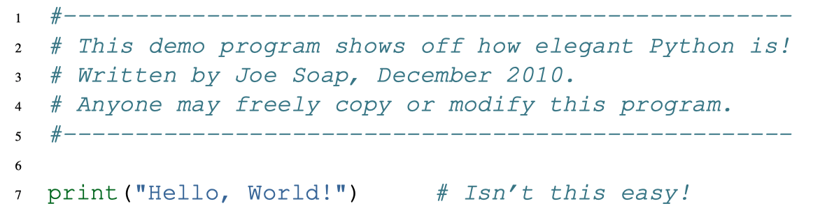

You’ll also notice that we’ve left a blank line in the program. Blank lines are also ignored by the interpreter, but comments and blank lines can make your programs much easier for humans to parse. Use them liberally!

# code/python

# Py1.12 Exercises
1. Write an English sentence with understandable semantics but incorrect syntax. Write another English sentence which has correct syntax but has semantic errors.

2. Using the Python interpreter, type 1 + 2 and then hit return. Python evaluates this expression, displays the result, and then shows another prompt. \* is the multiplication operator, and \*\* is the exponentiation operator. Experiment by entering different expressions and recording what is displayed by the Python interpreter.

3. Type 1 2 and then hit return. Python tries to evaluate the expression, but it can’t because the expression is not syntactically legal. Instead, it shows the error message:
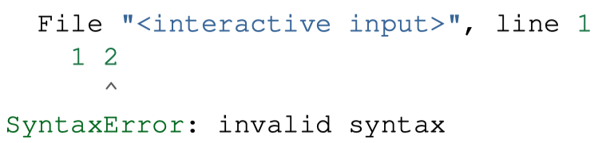

In many cases, Python indicates where the syntax error occurred, but it is not always right, and it doesn’t give you much information about what is wrong.

So, for the most part, the burden is on you to learn the syntax rules.

In this case, Python is complaining because there is no operator between the numbers. See if you can find a few more examples of things that will produce error messages when you enter them at the Python prompt. Write down what you enter at the prompt and the last line of the error message that Python reports back to you.

4. Type print("hello"). Python executes this, which has the effect of printing the letters h-e-l-l-o. Notice that the quotation marks that you used to enclose the string are not part of the output. Now type "hello" and describe your result. Make notes of when you see the quotation marks and when you don’t.

5. Type cheese without the quotation marks. The output will look something like this:
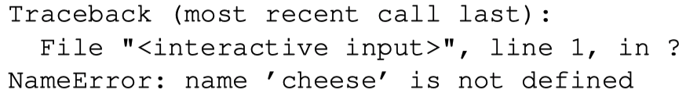

This is a run-time error; specifically, it is a NameError, and even more specifically, it is an error because the name cheese is not defined. If you don’t know what that means yet, you will soon.

6. Type 6 + 4 \* 9 at the Python prompt and hit enter. Record what happens.
Now create a Python script with the following contents:
> 1. 6 + 4 \* 9  
> 	What happens when you run this script? Now change the script contents to:
> 1. print(6 + 4 \* 9)  
> 	and run it again.

What happened this time?

Whenever an expression is typed at the Python prompt, it is evaluated and the result is automatically shown on the line below. (Like on your calculator, if you type this expression you’ll get the result 42.)

A script is different, however. Evaluations of expressions are not automatically displayed, so it is necessary to use the **print** function to make the answer show up.

It is hardly ever necessary to use the print function in immediate mode at the command prompt.

# code/python

## Py2 variables, expressions and statements
[Py2.1 values and data types](ulysses://x-callback-url/open?id=ILwqPY0IwmUJrTw46Q5F5A)
[Py2.2 variables](ulysses://x-callback-url/open?id=J-WxarrvPdLeGn4pTgAwXw)
[Py2.3 variable names and keywords](ulysses://x-callback-url/open?id=MnpRoeyCqiw9n27ZbSJ_MA)
[Py2.4 statements](ulysses://x-callback-url/open?id=CBayIv5xwF69P3afn0TrMA)
[Py2.5 evaluating expressions](ulysses://x-callback-url/open?id=MnpRoeyCqiw9n27ZbSJ_MA)
[Py2.6 Operators and operands](ulysses://x-callback-url/open?id=S0HQJPtXu8fw7K6iMrFklw)
[Py2.7 Type converter functions](ulysses://x-callback-url/open?id=2MLbpURHii38-OJW-A53OQ)
[Py2.8 Order of operations](ulysses://x-callback-url/open?id=SG9Beem3wwkJuKcQPSBlhA)
[Py2.9 Operations on strings](ulysses://x-callback-url/open?id=bsW8YhpGWDXftBDhvWNNQA)
[Py2.10 Input](ulysses://x-callback-url/open?id=MFyYpB59bO3CAOEHa4u5eA)
[Py2.11 Composition](ulysses://x-callback-url/open?id=YqX9wy_rCLUUxcHSy7OqyA)
[Py2.12 The modulus operator](ulysses://x-callback-url/open?id=f1qm5bbQ_qsyAvcJM3r-qA)
[Py2.14 Exercises](ulysses://x-callback-url/open?id=U6Egxytet44S53aUmQMZdw)
# code/python

# Py2.1 values and data types
A value is one of the fundamental things — like a letter or a number — that a program manipulates. The values we have seen so far are `4` (the result when we added `2 + 2`), and "`Hello, World!`".

These values are classified into different **classes**, or **data types**: `4` is an *integer*, and "`Hello, World!`" is a *string*, so-called because it contains a string of letters. You (and the interpreter) can identify strings because they are enclosed in quotation marks.

If you are not sure what class a value falls into, Python has a function called **type** which can tell you.

```python
>>> type("Hello, World!") 
<class ’str’>
>>> type(17) 
<class ’int’>
```

Not surprisingly, strings belong to the class **str** and integers belong to the class **int**. Less obviously, numbers with a decimal point belong to a class called **float**, because these numbers are represented in a format called ~floating-point~. At this stage, you can treat the words class and type interchangeably. We’ll come back to a deeper understanding of what a class is in later chapters.

```python
>>> type(3.2) 
<class ’float’>
```

What about values like `"17"` and `"3.2"`? They look like numbers, but they are in quotation marks like strings.

```python
>>> type("17") 
<class ’str’>
>>> type("3.2") 
<class ’str’>
```

They’re strings!

Strings in Python can be enclosed in either single quotes (’) or double quotes ("), or three of each (”’ or """)

```python
>>> type(’This is a string.’) 
<class ’str’>
>>> type("And so is this.") 
<class ’str’>
>>> type("""and this.""") 
<class ’str’>
>>> type(’’’and even this...’’’) 
<class ’str’>
```

Double quoted strings can contain single quotes inside them, as in `"Bruce’s beard"`, and single quoted strings can have double quotes inside them, as in `’The knights who say "Ni!"’`.

Strings enclosed with three occurrences of either quote symbol are called triple quoted strings. They can contain either single or double quotes:
```python
>>> print(’’’"Oh no", she exclaimed, "Ben’s bike is broken!"’’’) "Oh no", she exclaimed, "Ben’s bike is broken!"
>>>
```

Triple quoted strings can even span multiple lines:
```python
>>> message = """This message will 
... span several 
... lines."""
>>> print(message) 
This message will 
span several 
lines.
>>>
```
Python doesn’t care whether you use single or double quotes or the three-of-a-kind quotes to surround your strings: once it has parsed the text of your program or command, the way it stores the value is identical in all cases, and the surrounding quotes are not part of the value. But when the interpreter wants to display a string, it has to decide which quotes to use to make it look like a string.
```python
>>> ’This is a string.’ 
’This is a string.’
>>> """And so is this.""" 
’And so is this.’
```
So the Python language designers usually chose to surround their strings by single quotes. What do think would happen if the string already contained single quotes?

When you type a large integer, you might be tempted to use commas between groups of three digits, as in `42,000`. This is not a legal integer in Python, but it does mean something else, which is legal:
```python
>>> 42000 
42000
>>> 42,000 
(42, 0)
```
Well, that’s not what we expected at all! Because of the comma, Python chose to treat this as a pair of values. We’ll come back to learn about pairs later. But, for the moment, remember not to put commas or spaces in your integers, no matter how big they are. Also revisit what we said in the previous chapter: formal languages are strict, the notation is concise, and even the smallest change might mean something quite different from what you intended.

# code/python

# Py2.2 variables
One of the most powerful features of a programming language is the ability to manipulate **variables**. A variable is a name that refers to a value.

The **assignment statement** gives a value to a variable:
```python
>>> message = "What’s up, Doc?"
>>> n = 17
>>> pi = 3.14159
```
This example makes three assignments. The first assigns the string value "What’s up, Doc?" to a variable named message. The second gives the integer 17 to n, and the third assigns the floating-point number 3.14159 to a variable called pi.

The **assignment token**, =, should not be confused with equals, which uses the token ==. The assignment statement binds a name, on the left-hand side of the operator, to a value, on the right-hand side. This is why you will get an error if you enter:
```python
>>> 17 = n 
File "<interactive input>", line 1 
SyntaxError: can’t assign to literal
```
---- 
Tip: When reading or writing code, say to yourself “n is assigned 17” or “n gets the value 17”. Don’t say “n equals 17”.
---- 
A common way to represent variables on paper is to write the name with an arrow pointing to the variable’s value. This kind of figure is called a **state snapshot** because it shows what state each of the variables is in at a particular instant in time. (Think of it as the variable’s state of mind). This diagram shows the result of executing the assignment statements:
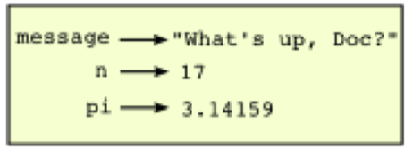
If you ask the interpreter to evaluate a variable, it will produce the value that is currently linked to the variable:
```python
>>> message 
’What’s up, Doc?’
>>> n 
17
>>> pi
3.14159
```
We use variables in a program to “remember” things, perhaps the current score at the football game. But variables are variable. This means they can change over time, just like the scoreboard at a football game. You can assign a value to a variable, and later assign a different value to the same variable. (This is different from maths. In maths, if you give ‘x‘ the value 3, it cannot change to link to a different value half-way through your calculations!)
```python
>>> day = "Thursday"
>>> day ’Thursday’
>>> day = "Friday"
>>> day ’Friday’
>>> day = 21
>>> day 
21
```
You’ll notice we changed the value of day three times, and on the third assignment we even made it refer to a value that was of a different type.

A great deal of programming is about having the computer remember things, e.g. The number of missed calls on your phone, and then arranging to update or change the variable when you miss another call.

# code/python

# Py2.3 variable names and keywords
Variable names can be arbitrarily long. They can contain both letters and digits, but they have to begin with a letter or an underscore. Although it is legal to use uppercase letters, by convention we don’t. If you do, remember that case matters. Bruce and bruce are different variables.

The underscore character ( \_) can appear in a name. It is often used in names with multiple words, such as my\_name or price\_of\_tea\_in\_china.

There are some situations in which names beginning with an underscore have special meaning, so a safe rule for beginners is to start all names with a letter.

If you give a variable an illegal name, you get a syntax error:
```python
>>> 76trombones = "big parade" 
SyntaxError: invalid syntax
>>> more$ = 1000000 
SyntaxError: invalid syntax
>>> class = "Computer Science 101" 
SyntaxError: invalid syntax
```
`76trombones` is illegal because it does not begin with a letter. more$ is illegal because it contains an illegal character, the dollar sign. But what’s wrong with class?

It turns out that class is one of the Python **keywords**. Keywords define the language’s syntax rules and structure, and they cannot be used as variable names.

Python has thirty-something keywords (and every now and again improvements to Python introduce or eliminate one or two):
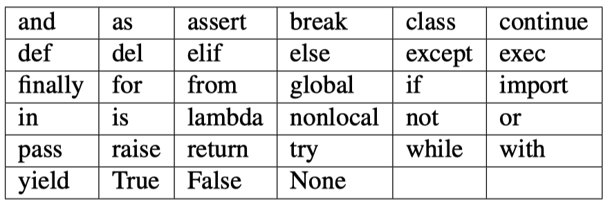
You might want to keep this list handy. If the interpreter complains about one of your variable names and you don’t know why, see if it is on this list.

Programmers generally choose names for their variables that are meaningful to the human readers of the program — they help the programmer document, or remember, what the variable is used for.

---- 
Caution: Beginners sometimes confuse “meaningful to the human readers” with “meaningful to the computer”. So they’ll wrongly think that because they’ve called some variable average or pi, it will somehow magically calculate an average, or magically know that the variable pi should have a value like 3.14159. No! The computer doesn’t understand what you intend the variable to mean.

So you’ll find some instructors who deliberately don’t choose meaningful names when they teach beginners — not because we don’t think it is a good habit, but because we’re trying to reinforce the message that you — the programmer — must write the program code to calculate the average, and you must write an assignment statement to give the variable pi the value you want it to have.
---- 
# code/python

# Py2.4 statements
A **statement** is an instruction that the Python interpreter can execute. We have only seen the assignment statement so far. Some other kinds of statements that we’ll see shortly are `while` statements, `for` statements, `if` statements, and `import` statements. (There are other kinds too!)

When you type a statement on the command line, Python executes it. Statements don’t produce any result.

# code/python

# Py2.5 evaluating expressions
An **expression** is a combination of values, variables, operators, and calls to functions. If you type an expression at the Python prompt, the interpreter **evaluates** it and displays the result:
```python
>>> 1 + 1 
2
>>> len("hello") 
5
```
In this example `len` is a built-in Python function that returns the number of characters in a string. We’ve previously seen the `print` and the `type` functions, so this is our third example of a function!

The *evaluation of an expression* produces a value, which is why expressions can appear on the right hand side of assignment statements. A value all by itself is a simple expression, and so is a variable.
```python
>>> 17 
17
>>> y = 3.14
>>> x = len("hello")
>>> x 
5
>>> y
3.14
```

# code/python

# Py2.6 Operators and operands
Operators are special tokens that represent computations like addition, multiplication and division. The values the operator uses are called operands.

The following are all legal Python expressions whose meaning is more or less clear:

`20+32`  `hour-1` `hour * 60+minute` `minute/60` `5 ** 2` `(5+9) * (15-7)`

The tokens +, -, and \* , and the use of parenthesis for grouping, mean in Python what they mean in mathematics. The asterisk ( \* ) is the token for multiplication, and \*\* is the token for exponentiation.
```python
>>> 2 ** 3 
8
>>> 3 ** 2 
9
```
When a variable name appears in the place of an operand, it is replaced with its value before the operation is performed.

Addition, subtraction, multiplication, and exponentiation all do what you expect.

Example: so let us convert 645 minutes into hours:
```python
>>> minutes = 645
>>> hours = minutes / 60
>>> hours
10.75
```
Oops! In Python 3, the division operator / always yields a floating point result. What we might have wanted to know was how many whole hours there are, and how many minutes remain. Python gives us two different flavors of the division operator. The second, called floor division uses the token //. Its result is always a whole number — and if it has to adjust the number it always moves it to the left on the number line. So 6 // 4 yields 1, but -6 // 4 might surprise you!
```python
>>> 7 / 4
1.75
>>> 7 // 4 
1
>>> minutes = 645
>>> hours = minutes // 60
>>> hours 
10
```
Take care that you choose the correct flavor of the division operator. If you’re working with expressions where you need floating point values, use the division operator that does the division accurately.

# code/python

# Py2.7 Type converter functions
Here we’ll look at three more Python functions, int, float and str, which will (attempt to) convert their arguments into types int, float and str respectively. We call these type converter functions.

The int function can take a floating point number or a string, and turn it into an int. For floating point numbers, it discards the decimal portion of the number — a process we call truncation towards zero on the number line. Let us see this in action:
```python
>>> int(3.14) 
3
>>> int(3.9999)  # This doesn’t round to the closest int!
3
>>> int(3.0) 
3
>>> int(-3.999) # Note that the result is closer to zero
-3
>>> int(minutes / 60) 
10
>>> int("2345")  # Parse a string to produce an int
2345
>>> int(17) # It even works if arg is already an int
17
>>> int("23 bottles")
```
This last case doesn’t look like a number — what do we expect?
```python
Traceback (most recent call last):
File "<interactive input>", line 1, in <module> 
ValueError: invalid literal for int() with base 10: ’23 bottles’
```
The type converter float can turn an integer, a float, or a syntactically legal string into a float:
```python
>>> float(17)
17.0
>>> float("123.45")
123.45
```
The type converter str turns its argument into a string:
```python
>>> str(17) 
’17’
>>> str(123.45) 
’123.45’
```
# code/python

# Py2.8 Order of operations
When more than one operator appears in an expression, the order of evaluation depends on the **rules of precedence**. Python follows the same precedence rules for its mathematical operators that mathematics does. The acronym **PEMDAS** is a useful way to remember the order of operations:

1. **P**arentheses have the highest precedence and can be used to force an expression to evaluate in the order you want. Since expressions in parentheses are evaluated first, 2 \* (3-1) is 4, and (1+1) \*\* (5-2) is 8. You can also use parentheses to make an expression easier to read, as in (minute \* 100) / 60, even though it doesn’t change the result.

2. **E**xponentiation has the next highest precedence, so 2 \*\* 1+1 is 3 and not 4, and 3 \* 1 \*\* 3 is 3 and not 27.

3. **M**ultiplication and both **D**ivision operators have the same precedence, which is higher than **A**ddition and **S**ubtraction, which also have the same precedence. So 2 \* 3-1 yields 5 rather than 4, and 5-2 \* 2 is 1, not 6.

4. Operators with the same precedence are evaluated from left-to-right. In algebra we say they are left-associative. So in the expression 6-3+2, the subtraction happens first, yielding 3. We then add 2 to get the result 5. If the operations had been evaluated from right to left, the result would have been 6-(3+2), which is 1. (The acronym PEDMAS could mislead you to thinking that division has higher precedence than multiplication, and addition is done ahead of subtraction - don’t be misled. Subtraction and addition are at the same precedence, and the left-to-right rule applies.)
	• Due to some historical quirk, an exception to the left-to-right left-associative rule is the exponentiation operator \*\* , so a useful hint is to always use parentheses to force exactly the order you want when exponentiation is involved:
```python
>>> 2 ** 3 ** 2 # The right-most ** operator gets done first!
512 
>>> (2 ** 3) ** 2 # Use parentheses to force the order you want!
64
```
The immediate mode command prompt of Python is great for exploring and experimenting with expressions like this.
# code/python

# Py2.9 Operations on strings
In general, you cannot perform mathematical operations on strings, even if the strings look like numbers. The following are illegal (assuming that message has type string):
```python
>>> message - 1			# Error
>>> "Hello" / 123		# Error
>>> message * "Hello"	# Error
>>> "15" + 2				# Error
```
Interestingly, the `+ operator` does work with strings, but for strings, the + operator represents **concatenation**, not addition. Concatenation means joining the two operands by linking them end-to-end. For example:
```python
fruit = "banana" 
baked_good = " nut bread" 
print(fruit + baked_good)
```
The output of this program is banana nut bread. The space before the word nut is part of the string, and is necessary to produce the space between the concatenated strings.

The `* operator` also works on strings; it performs **repetition**. For example, ’Fun’ \* 3 is ’FunFunFun’. One of the operands has to be a string; the other has to be an integer.

On one hand, this interpretation of + and \* makes sense by analogy with addition and multiplication. Just as 4 \* 3 is equivalent to 4+4+4, we expect "Fun" \* 3 to be the same as "Fun"+"Fun"+"Fun", and it is. On the other hand, there is a significant way in which string concatenation and repetition are different from integer addition and multiplication. Can you think of a property that addition and multiplication have that string concatenation and repetition do not?

# code/python

# Py2.10 Input
There is a built-in function in Python for getting input from the user:
`n = input("Please enter your name: ")`

A sample run of this script in PyScripter would pop up a dialog window like this:
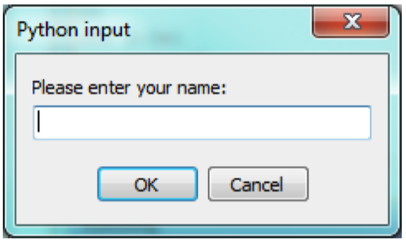
The user of the program can enter the name and click OK, and when this happens the text that has been entered is returned from the input function, and in this case assigned to the variable n.

Even if you asked the user to enter their age, you would get back a string like "17". It would be your job, as the programmer, to convert that string into a int or a float, using the int or float converter functions we saw earlier.

# code/python

# Py2.11 Composition
So far, we have looked at the elements of a program — variables, expressions, statements, and function calls — in isolation, without talking about how to combine them.

One of the most useful features of programming languages is their ability to take small building blocks and compose them into larger chunks.

For example, we know how to get the user to enter some input, we know how to convert the string we get into a float, we know how to write a complex expression, and we know how to print values. Let’s put these together in a small four-step program that asks the user to input a value for the radius of a circle, and then computes the area of the circle from the formula
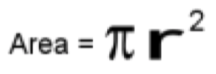
Firstly, we’ll do the four steps one at a time:
```python
response = input("What is your radius? ") 
r = float(response) 
area = 3.14159 * r ** 2 
print("The area is ", area)
```
Now let’s compose the first two lines into a single line of code, and compose the second two lines into another line of code.
```python
r = float( input("What is your radius? ") ) 
print("The area is ", 3.14159 * r ** 2)
```
If we really wanted to be tricky, we could write it all in one statement:
`print("The area is ", 3.14159 * float(input("What is your radius?")) ** 2)`
Such compact code may not be most understandable for humans, but it does illustrate how we can compose bigger chunks from our building blocks.

If you’re ever in doubt about whether to compose code or fragment it into smaller steps, try to make it as simple as you can for the human to follow. My choice would be the first case above, with four separate steps.

# code/python

# Py2.12 The modulus operator
The modulus operator works on integers (and integer expressions) and gives the remainder when the first number is divided by the second. In Python, the modulus operator is a percent sign (%). The syntax is the same as for other operators. It has the same precedence as the multiplication operator.

> > > q = 7 // 3 # This is integer division operator
> > > print(q) 
2
> > > r = 7 % 3
> > > print(r) 
1

So 7 divided by 3 is 2 with a remainder of 1.

The modulus operator turns out to be surprisingly useful. For example, you can check whether one number is divisible by another—if x % y is zero, then x is divisible by y.

Also, you can extract the right-most digit or digits from a number. For example, x % 10 yields the right-most digit of x (in base 10). Similarly x % 100 yields the last two digits.

It is also extremely useful for doing conversions, say from seconds, to hours, minutes and seconds. So let’s write a program to ask the user to enter some seconds, and we’ll convert them into hours, minutes, and remaining seconds.
```python
total_secs = int(input("How many seconds, in total?")) 
hours = total_secs // 3600 
secs_still_remaining = total_secs % 3600 
minutes = secs_still_remaining // 60 
secs_finally_remaining = secs_still_remaining % 60
print("Hrs=", hours, "mins=", minutes, "secs=", secs_finally_remaining)
```
# code/python

# Py2.14 Exercises
1. Take the sentence: All work and no play makes Jack a dull boy. Store each word in a separate variable, then print out the sentence on one line using print.
2. Add parenthesis to the expression 6 \* 1 - 2 to change its value from 4 to -6.
3. Place a comment before a line of code that previously worked, and record what happens when you rerun the program.
4. Start the Python interpreter and enter bruce + 4 at the prompt. This will give you an error:
	`NameError: name ’bruce’ is not defined`
Assign a value to bruce so that bruce + 4 evaluates to 10.

5. The formula for computing the final amount if one is earning compound interest is given on Wikipedia as
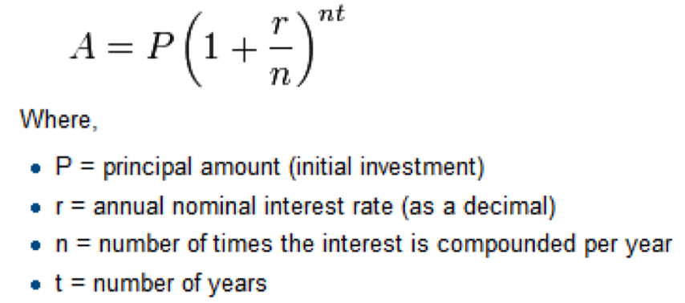
Write a Python program that assigns the principal amount of $10000 to variable P, assign to n the value 12, and assign to r the interest rate of 8%. Then have the program prompt the user for the number of years t that the money will be compounded for. Calculate and print the final amount after t years.

6. Evaluate the following numerical expressions in your head, then use the Python interpreter to check your results:
(a) \>\>\> 5 % 2
(b) \>\>\> 9 % 5
(c) \>\>\> 15 % 12
(d) \>\>\> 12 % 15
(e) \>\>\> 6 % 6
(f) \>\>\> 0 % 7
(g) \>\>\> 7 % 0 

What happened with the last example? Why? If you were able to correctly anticipate the computer’s response in all but the last one, it is time to move on. If not, take time now to make up examples of your own. Explore the modulus operator until you are confident you understand how it works.

7. You look at the clock and it is exactly 2pm. You set an alarm to go off in 51 hours. At what time does the alarm go off? (Hint: you could count on your fingers, but this is not what we’re after. If you are tempted to count on your fingers, change the 51 to 5100.)

8. Write a Python program to solve the general version of the above problem. Ask the user for the time now (in hours), and ask for the number of hours to wait. Your program should output what the time will be on the clock when the alarm goes off.
# code/python

## Py3 Our first turtle program
# Py3: Our first turtle program
There are many modules in Python that provide very powerful features that we can use in our own programs. Some of these can send email, or fetch web pages. The one we’ll look at in this chapter allows us to create turtles and get them to draw shapes and patterns.

The turtles are fun, but the real purpose of the chapter is to teach ourselves a little more Python, and to develop our theme of computational thinking, or thinking like a computer scientist. Most of the Python covered here will be explored in more depth later.

[Py3.1 Our first turtle program](ulysses://x-callback-url/open?id=i9HC8kSnwwQly-zbeGF47w)
[Py3.2 Instances - a herd of turtles](ulysses://x-callback-url/open?id=rJ35jo8XZ2yHB6VydOnljw)
[Py3.3 The for loop](ulysses://x-callback-url/open?id=l3gLLEeKnf-WSP7a1AH8vA)
[Py3.4 Flow of Execution of the for loop](ulysses://x-callback-url/open?id=gK1ZpFlk-C7HM0zxnvIrGw)
[Py3.5 The loop simplifies our turtle program](ulysses://x-callback-url/open?id=rm-fCuYgynWvVGA6sjjv-A)
[Py3.6 A few more turtle methods and tricks](ulysses://x-callback-url/open?id=_agd5aVqjgafFcwXddkLjQ)
[Py3.8 Exercises](ulysses://x-callback-url/open?id=ALrPPtgJKDeylcFIbFfmsg)


# code/python

# Py3.1 Our first turtle program
Let’s write a couple of lines of Python program to create a new turtle and start drawing a rectangle. (We’ll call the variable that refers to our first turtle alex, but we can choose another name if we follow the naming rules from the previous chapter).

```python
import turtle 			# Allows us to use turtles
wn = turtle.Screen() 	 # Creates a playground for turtles
alex = turtle.Turtle()	# Create a turtle, assign to alex

alex.forward(50) 		# Tell alex to move forward by 50 units
alex.left(90) 			 # Tell alex to turn by 90 degrees
alex.forward(30)		# Complete the second side of a rectangle

wn.mainloop()		# Wait for user to close window
```

When we run this program, a new window pops up:
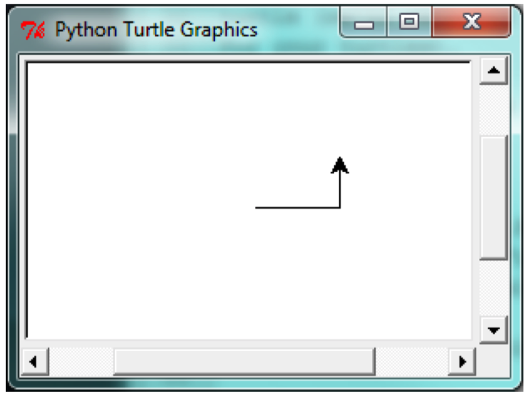
Here are a couple of things we’ll need to understand about this program.

The **first line** tells Python to load a module named turtle. That module brings us two new types that we can use: the Turtle type, and the Screen type. The dot notation turtle.Turtle means “The Turtle type that is defined within the turtle module”. (Remember that Python is case sensitive, so the module name, with a lowercase “t”, is different from the type Turtle.)

We **then** create and open what it calls a screen (we would prefer to call it a window), which we assign to variable “wn”. Every window contains a canvas, which is the area inside the window on which we can draw.

In **line 3** we create a turtle. The variable “alex” is made to refer to this turtle.

So these first three lines have set things up, we’re ready to get our turtle to draw on our canvas.

In **lines 5-7**, we instruct the object alex to move, and to turn. We do this by invoking, or activating, alex‘s methods — these are the instructions that all turtles know how to respond to.

The last line plays a part too: the wn variable refers to the window shown above. When we invoke its mainloop method, it enters a state where it waits for events (like keypresses, or mouse movement and clicks). The program will terminate when the user closes the window.

An object can have various methods — things it can do — and it can also have attributes — (sometimes called properties). For example, each turtle has a color attribute. The method invocation `alex.color("red")` will make alex red, and drawing will be red too. (Note the word color is spelled the American way!)

The color of the turtle, the width of its pen, the position of the turtle within the window, which way it is facing, and so on are all part of its current state. Similarly, the window object has a background color, and some text in the title bar, and a size and position on the screen. These are all part of the state of the window object.

Quite a number of methods exist that allow us to modify the turtle and the window objects. We’ll just show a couple. In this program we’ve only commented those lines that are different from the previous example (and we’ve used a different variable name for this turtle):

```
import turtle 
wn = turtle.Screen()
wn.bgcolor("lightgreen") 	# Set the window background color
wn.title("Hello, Tess!")		# Set the window title

tess = turtle.Turtle() 
tess.color("blue") 		# Tell tess to change her color
tess.pensize(3)			# Tell tess to set her pen width

tess.forward(50) 
tess.left(120) 
tess.forward(50)

wn.mainloop()
```
When we run this program, this new window pops up, and will remain on the screen until we close it.
---- 
## Extend this program ...
1. Modify this program so that before it creates the window, it prompts the user to enter the desired background color. It should store the user’s responses in a variable, and modify the color of the window according to the user’s wishes. (Hint: you can find a list of permitted color names at http://www.tcl.tk/man/tcl8.4/TkCmd/colors.htm. It includes some quite unusual ones, like “peach puff” and “HotPink”.)

2. Do similar changes to allow the user, at runtime, to set tess‘ color.

3. Do the same for the width of tess‘ pen. Hint: your dialog with the user will return a string, but tess‘ pensize method expects its argument to be an int. So you’ll need to convert the string to an int before you pass it to pensize.

# code/python

# Py3.2 Instances - a herd of turtles
Just like we can have many different integers in a program, we can have many turtles. Each of them is called an instance. Each instance has its own attributes and methods — so alex might draw with a thin black pen and be at some position, while tess might be going in her own direction with a fat pink pen.

```python
import turtle 
wn = turtle.Screen() 
wn.bgcolor("lightgreen") 
wn.title("Tess & Alex")

tess = turtle.Turtle() 
tess.color("hotpink") 
tess.pensize(5)

alex = turtle.Turtle()

tess.forward(80) 
tess.left(120) 
tess.forward(80) 
tess.left(120) 
tess.forward(80) 
tess.left(120)

tess.right(180) 
tess.forward(80)

alex.forward(50) 
alex.left(90) 
alex.forward(50) 
alex.left(90) 
alex.forward(50) 
alex.left(90) 
alex.forward(50) 
alex.left(90)

wn.mainloop()
```

Here is what happens when alex completes his rectangle, and tess completes her triangle:
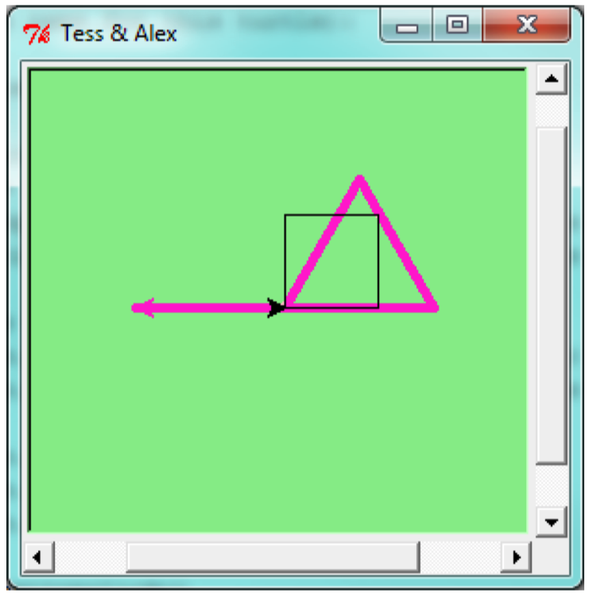
Here are some How to think like a computer scientist observations:
• There are 360 degrees in a full circle. If we add up all the turns that a turtle makes, no matter what steps occurred between the turns, we can easily figure out if they add up to some multiple of 360. This should convince us that alex is facing in exactly the same direction as he was when he was first created. (Geometry conventions have 0 degrees facing East, and that is the case here too!)

• We could have left out the last turn for alex, but that would not have been as satisfying. If we’re asked to draw a closed shape like a square or a rectangle, it is a good idea to complete all the turns and to leave the turtle back where it started, facing the same direction as it started in. This makes reasoning about the program and composing chunks of code into bigger programs easier for us humans!

• We did the same with tess: she drew her triangle, and turned through a full 360 degrees. Then we turned her around and moved her aside. Even the blank line 18 is a hint about how the programmer’s mental chunking is working: in big terms, tess‘ movements were chunked as “draw the triangle” (lines 12-17) and then “move away from the origin” (lines 19 and 20).

• One of the key uses for comments is to record our mental chunking, and big ideas.

They’re not always explicit in the code.

• And, uh-huh, two turtles may not be enough for a herd. But the important idea is that the turtle module gives us a kind of factory that lets us create as many turtles as we need. Each instance has its own state and behaviour.

# code/python

# Py3.3 The for loop
When we drew the square, it was quite tedious. We had to explicitly repeat the steps of moving and turning four times. If we were drawing a hexagon, or an octogon, or a polygon with 42 sides, it would have been worse.

So a basic building block of all programs is to be able to repeat some code, over and over again.

Python’s `for` loop solves this for us. Let’s say we have some friends, and we’d like to send them each an email inviting them to our party. We don’t quite know how to send email yet, so for the moment we’ll just print a message for each friend:

```python
for f in ["Joe","Zoe","Brad","Angelina","Zuki","Thandi","Paris"]:
	invite = "Hi " + f + ". Please come to my party on Saturday!"
	print(invite) 
‘# more code can follow here ...
```

When we run this, the output looks like this:
> Hi Joe. Please come to my party on Saturday!  
> Hi Zoe. Please come to my party on Saturday!  
> Hi Brad. Please come to my party on Saturday!  
> Hi Angelina. Please come to my party on Saturday!  
> Hi Zuki. Please come to my party on Saturday!  
> Hi Thandi. Please come to my party on Saturday!  
> Hi Paris. Please come to my party on Saturday!  
> 
• The variable f in the for statement at line 1 is called the loop variable. We could have chosen any other variable name instead.
• Lines 2 and 3 are the loop body. The loop body is always indented. The indentation determines exactly what statements are “in the body of the loop”.
• On each iteration or pass of the loop, first a check is done to see if there are still more items to be processed. If there are none left (this is called the terminating condition of the loop), the loop has finished. Program execution continues at the next statement after the loop body, (e.g. in this case the next statement below the comment in line 4).
• If there are items still to be processed, the loop variable is updated to refer to the next item in the list. This means, in this case, that the loop body is executed here 7 times, and each time f will refer to a different friend.
• At the end of each execution of the body of the loop, Python returns to the for statement, to see if there are more items to be handled, and to assign the next one to f.

# code/python

# Py3.4 Flow of Execution of the for loop
As a program executes, the interpreter always keeps track of which statement is about to be executed. We call this the control flow, of the flow of execution of the program. When humans execute programs, they often use their finger to point to each statement in turn. So we could think of control flow as “Python’s moving finger”.

Control flow until now has been strictly top to bottom, one statement at a time. The for loop changes this.

Control flow is often easy to visualize and understand if we draw a flowchart. This shows the exact steps and logic of how the for statement executes.


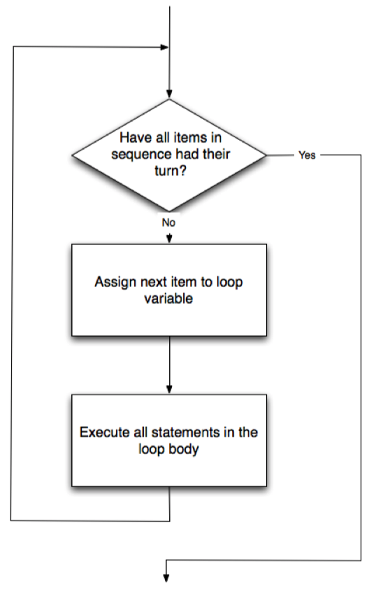
# code/python

# Py3.5 The loop simplifies our turtle program
To draw a square we’d like to do the same thing four times — move the turtle, and turn. We previously used 8 lines to have alex draw the four sides of a square. This does exactly the same, but using just three lines:
```python
for i in [0,1,2,3]:
	alex.forward(50) 
	alex.left(90)
```

Some observations:
• While “saving some lines of code” might be convenient, it is not the big deal here. What is much more important is that we’ve found a “repeating pattern” of statements, and reorganized our program to repeat the pattern. Finding the chunks and somehow getting our programs arranged around those chunks is a vital skill in computational thinking.
• The values [0,1,2,3] were provided to make the loop body execute 4 times. We could have used any four values, but these are the conventional ones to use. In fact, they are so popular that Python gives us special built-in range objects:

```python
for i in range(4):
‘# Executes the body with i = 0, then 1, then 2, then 3 

for x in range(10):
‘# Sets x to each of ... [0, 1, 2, 3, 4, 5, 6, 7, 8, 9]
```

• Computer scientists like to count from 0!
• range can deliver a sequence of values to the loop variable in the for loop. They start at 0, and in these cases do not include the 4 or the 10.
• Our little trick earlier to make sure that alex did the final turn to complete 360 degrees has paid off: if we had not done that, then we would not have been able to use a loop for the fourth side of the square. It would have become a “special case”, different from the other sides. When possible, we’d much prefer to make our code fit a general pattern, rather than have to create a special case.

So to repeat something four times, a good Python programmer would do this:
```python
for i in range(4):
	alex.forward(50) 
	alex.left(90)
```
By now you should be able to see how to change our previous program so that tess can also use a for loop to draw her equilateral triangle.

But now, what would happen if we made this change?
```python
for c in ["yellow", "red", "purple", "blue"]:
	alex.color(c) 
	alex.forward(50) 
	alex.left(90)
```
A variable can also be assigned a value that is a list. So lists can also be used in more general situations, not only in the for loop. The code above could be rewritten like this:
```python
‘# Assign a list to a variable 
clrs = ["yellow", "red", "purple", "blue"] 
for c in clrs:
	alex.color(c) 
	alex.forward(50) 
	alex.left(90)
```

# code/python

# Py3.6 A few more turtle methods and tricks
Turtle methods can use negative angles or distances. So tess.forward(-100) will move tess backwards, and tess.left(-30) turns her to the right. Additionally, because there are 360 degrees in a circle, turning 30 to the left will get tess facing in the same direction as turning 330 to the right! (The on-screen animation will differ, though — you will be able to tell if tess is turning clockwise or counter-clockwise!)

This suggests that we don’t need both a left and a right turn method — we could be minimalists, and just have one method. There is also a backward method. (If you are very nerdy, you might enjoy saying alex.backward(-100) to move alex forward!)

Part of thinking like a scientist is to understand more of the structure and rich relationships in our field. So revising a few basic facts about geometry and number lines, and spotting the relationships between left, right, backward, forward, negative and positive distances or angles values is a good start if we’re going to play with turtles.

A turtle’s pen can be picked up or put down. This allows us to move a turtle to a different place without drawing a line. The methods are
```python
alex.penup() 
alex.forward(100) 	# This moves alex, but no line is drawn
alex.pendown()
```
Every turtle can have its own shape. The ones available “out of the box” are arrow, blank, circle, classic, square, triangle, turtle.

`alex.shape("turtle")`
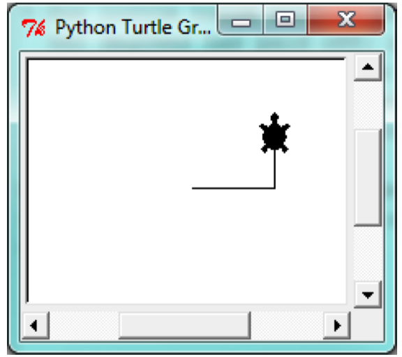

We can speed up or slow down the turtle’s animation speed. (Animation controls how quickly the turtle turns and moves forward). Speed settings can be set between 1 (slowest) to 10 (fastest). But if we set the speed to 0, it has a special meaning — turn off animation and go as fast as possible.

alex.speed(10)

A turtle can “stamp” its footprint onto the canvas, and this will remain after the turtle has moved somewhere else. Stamping works, even when the pen is up.

Let’s do an example that shows off some of these new features:

```python
import turtle`
wn = turtle.Screen()`
wn.bgcolor("lightgreen")`
tess = turtle.Turtle()`
tess.shape("turtle")`
tess.color("blue")`

tess.penup() 		# This is new`
size = 20`
for i in range(30):`
tess.stamp() 			# Leave an impression on the canvas`
size = size + 3 		# Increase the size on every iteration`
tess.forward(size)		# Move tess along`
tess.right(24) 		# … and turn her`

wn.mainloop()

```


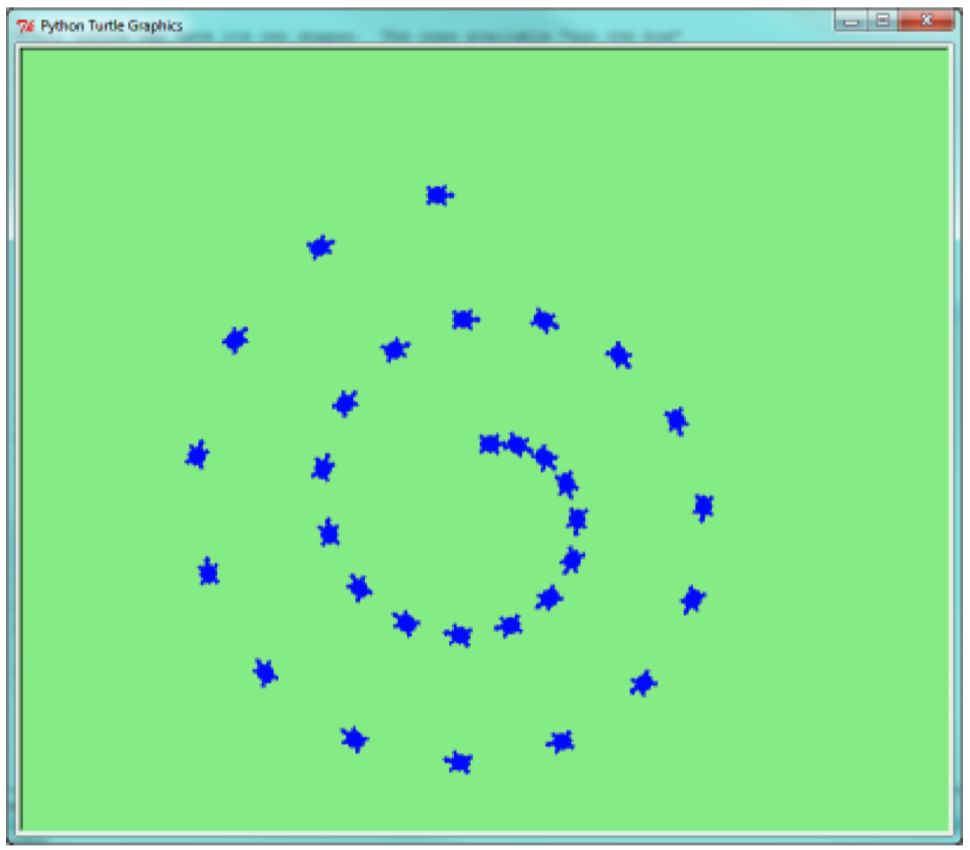
Be careful now! How many times was the body of the loop executed? How many turtle images do we see on the screen? All except one of the shapes we see on the screen here are footprints created by stamp. But the program still only has one turtle instance — can you figure out which one here is the real tess? (Hint: if you’re not sure, write a new line of code after the for loop to change tess‘ color, or to put her pen down and draw a line, or to change her shape, etc.)

# code/python

# Py3.8 Exercises
1. Write a program that prints We like Python’s turtles! 1000 times.

2. Give three attributes of your cellphone object. Give three methods of your cellphone.

3. Write a program that uses a for loop to print One of the months of the year is January One of the months of the year is February ...

4. Suppose our turtle tess is at heading 0 — facing east. We execute the statement tess.left(3645). What does tess do, and what is her final heading?

5. Assume you have the assignment xs = [12, 10, 32, 3, 66, 17, 42, 99, 20]

(a) Write a loop that prints each of the numbers on a new line.

(b) Write a loop that prints each number and its square on a new line.

(c) Write a loop that adds all the numbers from the list into a variable called total. You should set the total variable to have the value 0 before you start adding them up, and print the value in total after the loop has completed.

(d) Print the product of all the numbers in the list. (product means all multiplied together)

6. Use for loops to make a turtle draw these regular polygons (regular means all sides the same lengths, all angles the same):
7. • An equilateral triangle

• A square

• A hexagon (six sides)

• An octagon (eight sides)

7. A drunk pirate makes a random turn and then takes 100 steps forward, makes another random turn, takes another 100 steps, turns another random amount, etc. A social science student records the angle of each turn before the next 100 steps are taken. Her experimental data is [160, -43, 270, -97, -43, 200, -940, 17, -86]. (Positive angles are counter-clockwise.) Use a turtle to draw the path taken by our drunk friend.

8. Enhance your program above to also tell us what the drunk pirate’s heading is after he has finished stumbling around. (Assume he begins at heading 0).

9. If you were going to draw a regular polygon with 18 sides, what angle would you need to turn the turtle at each corner?

10. At the interactive prompt, anticipate what each of the following lines will do, and then record what happens. Score yourself, giving yourself one point for each one you anticipate correctly:

> > > import turtle
> > > wn = turtle.Screen()
> > > tess = turtle.Turtle()
> > > tess.right(90)
> > > tess.left(3600)
> > > tess.right(-90)
> > > tess.speed(10)
> > > tess.left(3600)
> > > tess.speed(0)
> > > tess.left(3645)
> > > tess.forward(-100)

11. Write a program to draw a shape like this:

Hints:

• Try this on a piece of paper, moving and turning your cellphone as if it was a turtle. Watch how many complete rotations your cellphone makes before you complete the star. Since each full rotation is 360 degrees, you can figure out the total number of degrees that your phone was rotated through. If you divide that by 5, because there are five points to the star, you’ll know how many degrees to turn the turtle at each point.

• You can hide a turtle behind its invisibility cloak if you don’t want it shown. It will still draw its lines if its pen is down. The method is invoked as tess.hideturtle() . To make the turtle visible again, use tess.showturtle() .
12. Write a program to draw a face of a clock that looks something like this:
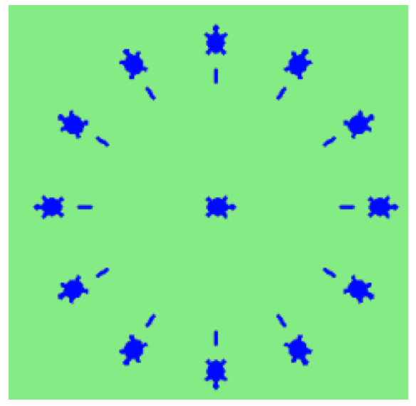
13. Create a turtle, and assign it to a variable. When you ask for its type, what do you get?
14. What is the collective noun for turtles? (Hint: they don’t come in herds.)
15. What the collective noun for pythons? Is a python a viper? Is a python venomous?
# code/python

# Coding

# code/excel
# code/python
# code/c# code/access