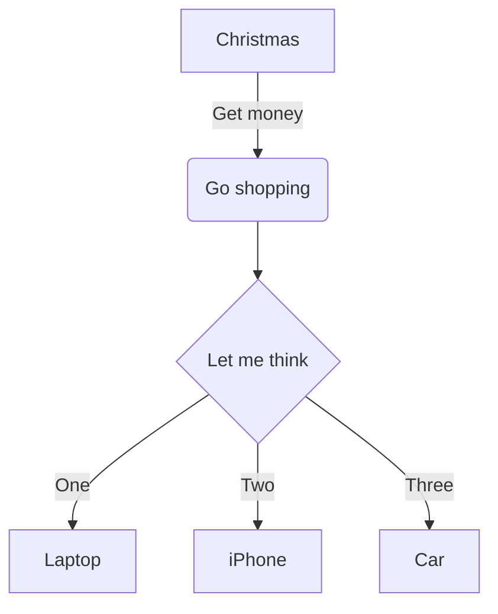
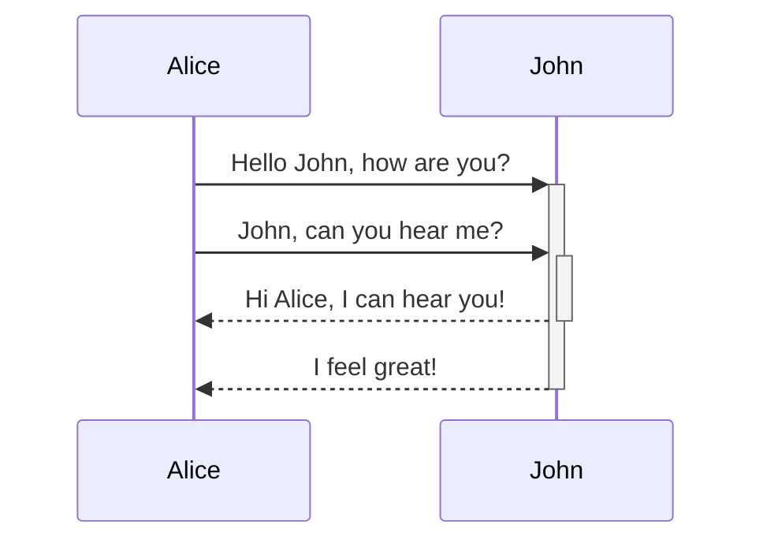
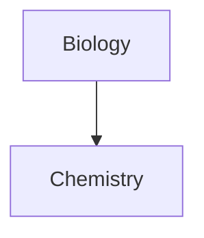

```mermaid
graph TD
	A[Christmas] -->|Get money| B(Go shopping)
	B -->C{Let me think}
	C-->|One| D[Laptop]
	C-->|Two| E[iPhone]
	C-->|Three| F[Car]
```

```mermaid
sequenceDiagram
    Alice->>+John: Hello John, how are you?
    Alice->>+John: John, can you hear me?
    John-->>-Alice: Hi Alice, I can hear you!
    John-->>-Alice: I feel great!
```

```mermaid
graph TD

Biology --> Chemistry

class Biology,Chemistry internal-link;
```

```mermaid
graph TD

A[Biology]
B[Chemistry]

A --> B

class A,B,C,D,E,F,G,H,I,J,K,L,M,N,O,P,Q,R,S,T,U,V,W,X,Y,Z internal-link;
```

