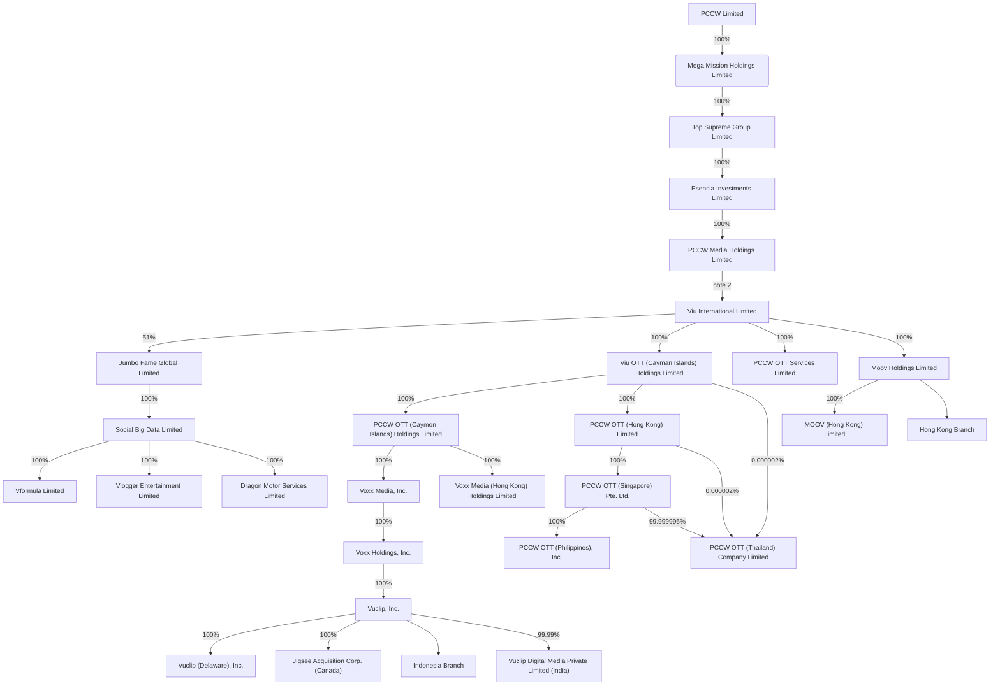

```mermaid
graph TD
	A[PCCW Limited] -->|100%| B(Mega Mission Holdings Limited)
	B-->|100%| C[Top Supreme Group Limited]
	C-->|100%| D[Esencia Investments Limited]
	D-->|100%| E[PCCW Media Holdings Limited]
	E-->|note 2| F[Viu International Limited]
	F-->|51%| G[Jumbo Fame Global Limited]
	F-->|100%| H["Viu OTT (Cayman Islands) Holdings Limited"]
	F-->|100%| I[PCCW OTT Services Limited]
	F-->|100%| J[Moov Holdings Limited]
	G-->|100%| K["Social Big Data Limited"]
	K-->|100%| L[Vformula Limited]
	K-->|100%| M[Vlogger Entertainment Limited]
	K-->|100%| N[Dragon Motor Services Limited]
	H-->|100%| O["PCCW OTT (Caymon Islands) Holdings Limited"]
	O-->|100%| P[Voxx Media, Inc.]
	O-->|100%| Q["Voxx Media (Hong Kong) Holdings Limited"]
	H-->|100%| R["PCCW OTT (Hong Kong) Limited"]
	H-->|0.000002%| S["PCCW OTT (Thailand) Company Limited"]
	R-->|100%| T["PCCW OTT (Singapore) Pte. Ltd."]
	T-->|100%| U["PCCW OTT (Philippines), Inc."]
	T-->|99.999996%| S["PCCW OTT (Thailand) Company Limited"]
	R-->|0.000002%| S["PCCW OTT (Thailand) Company Limited"]
	J-->|100%| V["MOOV (Hong Kong) Limited"]
	J--> W[Hong Kong Branch]
	P-->|100%| X[Voxx Holdings, Inc.]
	X-->|100%| Y[Vuclip, Inc.]
	Y-->|100%| Z["Vuclip (Delaware), Inc."]
	Y-->|100%| AA["Jigsee Acquisition Corp. (Canada)"]
	Y--> AB[Indonesia Branch]
	Y-->|99.99%| AC["Vuclip Digital Media Private Limited (India)"]

	class A,B,C,D,E,F,G,H,I,J,K,L,M,N,O,P,Q,R,S,T,U,V,W,X,Y,Z,AA,AB,AC internal-link;
```
