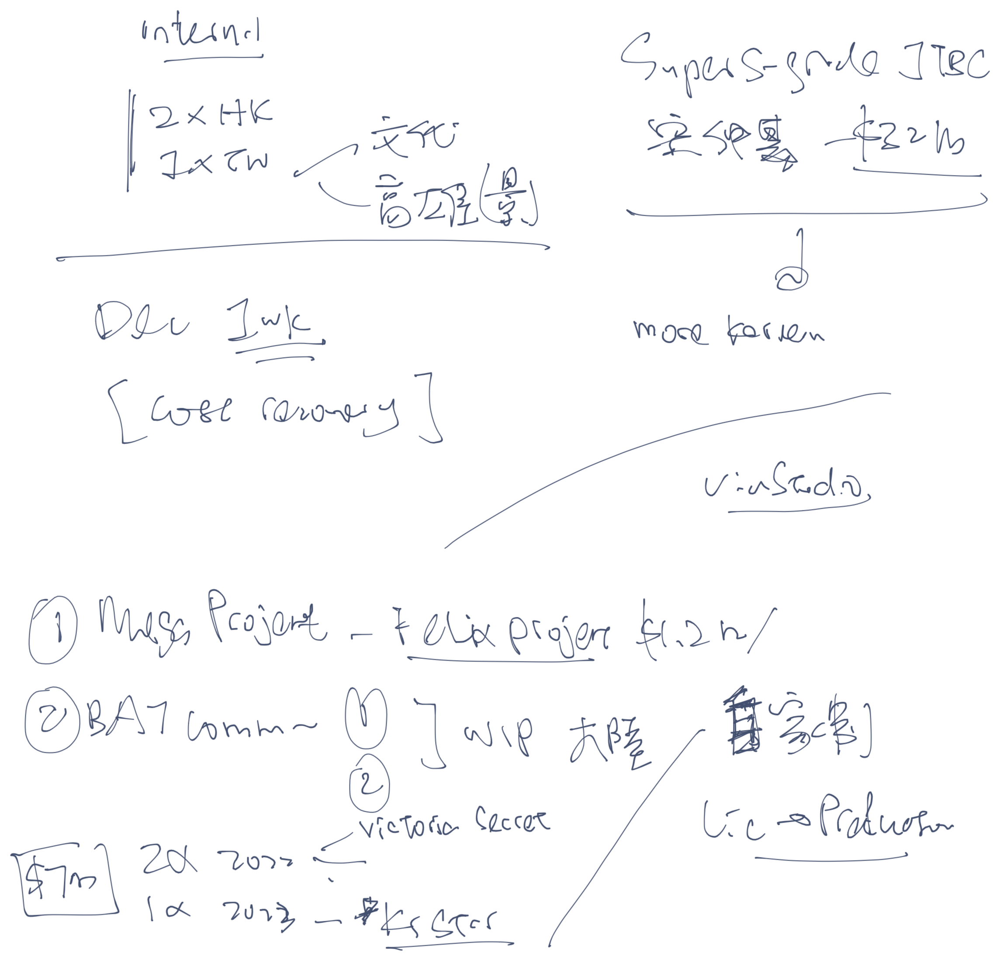
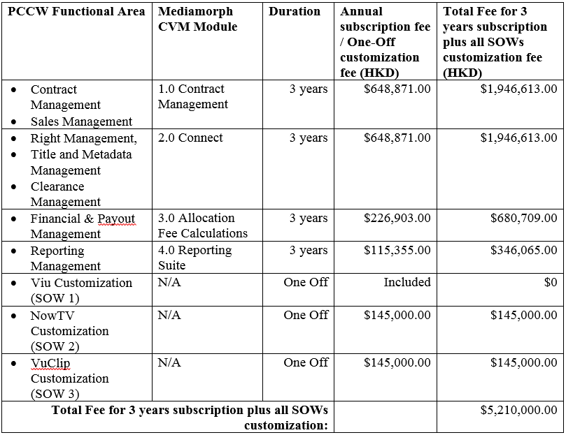
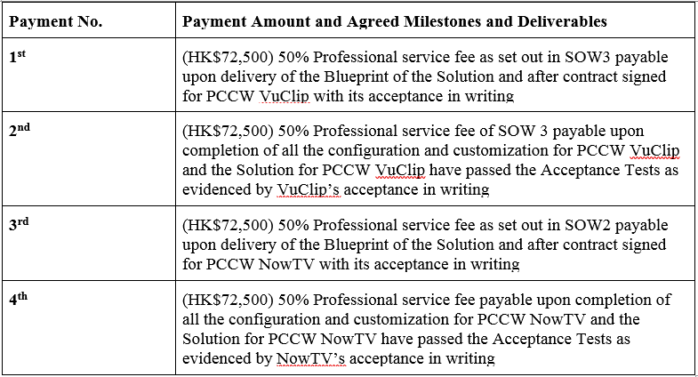

Helen AOP 2022

## NowE and Viu Revenue 2021 Jan - Nov

out

Content AOP

AOP 2022 finance internal discussion

AOP 

## Insurance projection

## Price Fixing

Price fixing is when competitors agree on pricing rather than competing against each other. This includes agreeing to prices, a formula to calculate prices / margin or elements of a price such as discounts, rebates, promotions or credit terms.

Price fixing can occur verbally or in writing – agreement can be by a 'wink and a nod', made over a drink, price fixing can occur at an association meeting or at a social occasion.

In a competitive market, each competitor should make price decisions independently. Anything that removes price uncertainty between competitors risks being a form of price fixing which hurts consumers and other businesses.

Price fixing increases prices and reduce quality of the products sold. Under the Competition Ordinance, it is a serious anti-competitive conduct.

Reseller?

# Overview
## What is Competition?

In a free market economy, businesses compete with each other to offer the best range of products at the best price. A competitive market leads to better prices, products and choice for everyone.

Competition also drives efficiency and innovation, and directs businesses to meet consumer demands by providing the right products at the right price and quality.

## Understanding the Competition Ordinance

Click [here](https://www.compcomm.hk/en/media/reports_publications/other_publications.html) for easy-to-follow brochures to help you understand the Competition Ordinance.

The Competition Ordinance is designed to promote competition and prohibit anti-competitive practices.

The introduction of a cross-sector competition regime to Hong Kong is an important step in safeguarding our shared value of fair competition. The Competition Ordinance (Ordinance) ensures this by making certain business practices which undermine competition illegal.

The Ordinance prohibits three types of anti-competitive conduct described under the First Conduct Rule, the Second Conduct Rule and the Merger Rule which are collectively known as the "competition rules".

The Competition Commission (Commission) has produced a number of videos and infographics which describe simply different types of anti-competitive conduct.

For further information, please refer to the Guideline on the First Conduct Rule. You can also read “The Competition Ordinance and SMEs" brochure to learn more about different type of anti-competitive conduct in an easy-to-understand approach.

The First Conduct Rule

The First Conduct Rule seeks to prohibit arrangements between market participants (whether they are competitors or not) which prevent, restrict or distort competition in Hong Kong. For example, it prevents competitors colluding on key parameters of competition such as price, output or how they bid to harm competition in Hong Kong.

These propositions are embodied in the First Conduct Rule set out in section 6(1) of the Ordinance:

“An undertaking must not (a) make or give effect to an agreement; (b) engage in a concerted practice; or (c) as a member of an association of undertakings, make or give effect to a decision of the association, if the object or effect of the agreement, concerted practice or decision is to prevent, restrict or distort competition in Hong Kong.”

Examples of conduct which may contravene the First Conduct Rule include:

Cartels (i.e. agreeing with your competitors to fix prices, share markets, rig bids or restrict output)
Exchange of information
Activities of trade associations and industry bodies
Joint Ventures
Vertical price restrictions
Exclusive distribution and exclusive customer allocation
The Second Conduct Rule

Under the Ordinance, businesses with a substantial degree of market power are also prohibited from abusing that power to harm competition.

The Second Conduct Rule targets businesses with a substantial degree of market power in abusing that power with a view to protecting or increasing their position of power and profits. Competition law is not concerned with the mere possession of substantial degree of market power. It is only when there is an abuse of such power that raises concerns. Certain conduct (see the examples provided below) engaged in by businesses with substantial market power can have the object or effect of excluding competitors from the market, thereby limiting choices available to consumers. This principle is embodied in section 21 of the Ordinance, or the Second Conduct Rule:

(1) An undertaking that has a substantial degree of market power in a market must not abuse that power by engaging in conduct that has as its object or effect the prevention, restriction or distortion of competition in Hong Kong.

(2) For the purpose of subsection (1), conduct may, in particular, constitute such an abuse if it involves—

(a) predatory behaviour towards competitors; or
(b) limiting production, markets or technical development to the prejudice of consumers.

Only a limited number of large businesses are likely to have substantial market power. Small and medium-sized undertakings may be victims of abusive conduct under the Second Conduct Rule.

Examples of conduct which may contravene the Second Conduct Rule include:

Predatory pricing
Anti-competitive tying and bundling
Margin squeeze
Refusals to deal
Exclusive dealing
The Merger Rule

Mergers that have or are likely to have the effect of substantially lessening competition in Hong Kong are prohibited under the Ordinance. The scope of application of the Merger Rule is currently limited to mergers relating to undertakings directly or indirectly holding carrier licences issued under the Telecommunications Ordinance (Cap. 106).

How do I comply?

The Commission has released easy to follow brochures, a toolkit and videos for trade associations and small and medium enterprises to help them understand the Ordinance. You may also refer to this website and the Commission’s Guidelines.

How do I complain?

Details on how to contact the Commission to make a complaint are here.

## Here is Veronica's elaboration on the distribution agent vs Competition Guidelines:

" The concept of an agency arrangement, in this case a distribution agent, is basically the same under competition law as in any other context. The Guidelines issued by the Competition Commission ("Guidelines") set out some guidance on what the Competition Commission considers to be a "true distribution agent". In the case of services, " a distributor acts as a true distribution agent of the supplier if it does not bear any, or only bears insignificant, risks in relation to the contracts concluded on behalf of the supplier. This might be the case where the distribution agent [in this case SUN](#) does not itself supply the contract services and where the distribution agent does not bear any, or bears only an insignificant portion, of...risks and costs." The Guidelines include a non-exhaustive list of risks and costs which is generally more relevant to goods rather than services but which notably includes costs or risks associated with non-performance by the customer (e.g. late or non-payment by the customer). Where a distributor is acting as a  "true distribution agent" the provisions of the Competition Ordinance regarding anti-competitive agreements will not apply to restrictions imposed in the distribution agreement in so far as they relate to contracts concluded on behalf of the supplier. This includes restrictions imposed on the distributor which limits the prices and conditions at which the distributor can sell the contract products/services.

"Suggested Retail Price" is always acceptable as long as this is true and that the downstream seller does actually have the discretion to change the retail price should they wish to. "

Hope this helps and let me know if you want to have further discussion with Veronica on Competition related issues.

## Digital Media

It started with now.com, MOOV and game
Recent years it has expanding to 
- OTT (Viu)
- Vlogger (KOL)

### OTT Business

## Marketing

## Content

## Business development

## AIS telco arrangement for 2nd contract term

# OTT business

What attract audience?
1. Content
2. User interface
3. Price
4. User experience

5. Marketing

## OTT TH business
Launch: May 2017
Telco: AIS - MG deal - with 

# Mediamorph
[Mediamorph contract](https://www.icloud.com/iclouddrive/0m1jKnv8YyDN_h5OJaqsntSrw#AGMT-Contract_and_Right_Management_System_v20190517_copy)
- London company

**Our party: PCCW Media Limited**
**Rights**: Supplier - license the Contract and Right Management system to PCCW and this Affiliates 
	- Licensed software: including Updates and Upgrades to such software
		- **Updates**: means a new release or service patch of the Licensed Software and/or Custom Programs which may contain error corrections, and minor enhancements. In the case of Updates for Licensed Software, such Updates are generally made available to the SUPPLIER’s licensees who are subscribers of the SUPPLIER’s support services including all modifications or enhancements to such programs at no additional costs.
		- **Upgrades**: means a new release of the Licensed Software and/or Custom Programs which involves the addition of substantial or substantially enhanced functionality of the Licensed Software and/or Custom Programs. In the case of Upgrades for Licensed Software, such Upgrades are generally made available to the SUPPLIER’s licensees who are subscribers of the SUPPLIER’s support services including all modifications or enhancements to such programs at no additional costs. Upgrades do not include functionality that is separately priced for SUPPLIER’s licensees.
	- Grant of license: internal use and accessible only by Named Users (45 read/write users; unlimited read-only users)
	- Non-exclusive, non-transferable and non-sublicensable

**Fee: HK$5,210,000** [[Mediamorph license fees 2019-22]]
	- DM: HK$1,413,097 ($471,032.33/yr)
	- NowTV: HK$1,413,097 ($471,032.33/yr) + HK$145,000
	- Vuclip: HK$2,093,806 ($697,935.33/yr) + HK$145,000
Period: 3-year term

NowTV: Warwick - 
Vuclip: OK, 2 more modules
DM: 

Original content - asset - investor reports -\> system to extract

Vuclip use the content first: around end of Jun - IGC 

# Mediamorph license fees 2019-22

## Payment Terms
The total fees for the Contract and Right Management System for the Initial 3-year term at HK$5,210,000.00 shall be all-inclusive for the provision of the Contract and Right Management System for 45 read/write seats (users) including all the Licensed Software, Services (not including travel and expenses), Service Deliverables, Hosting and Support Services under this Agreement as defined in Schedules A, B, C, D, F and G herein. The unlimited read-only users that can receive royalty statements from the Allocation Fee Calculations module.

The total fees shall be paid according to the following payment schedule within 30 Days from the date of the receipt of the relevant invoice after such payment has become payable.

Unpaid amounts that are 30 days or more past due are subject to a finance charge of one and one-half percent (1.5%) per month on any outstanding balance, or the maximum permitted by law, whichever is lower, plus all reasonable expenses of collection.

All travel expenses re-billed at cost to PCCW with prior written approval.

## Payment for the Annual License Fees
### Payment Milestones:
#### PCCW Viu Payment milestone for the License Fees:
a.	1st year License Fee for the Initial 3-year Term (HK$ 471,032.33) payable upon delivery of all the Services and Service Deliverables for PCCW Viu as set out in SOW 1 and the Solution for PCCW Viu has been running in production for 1-month Warranty Period with no defect during such 1-month Warranty Period as evidenced by PCCW Viu’s acceptance in writing (“1st Year License Start Date for Viu”)
b.	2nd Year License Fee for the Initial 3-year Term (HK$ 471,032.33) payable upon the 12 month anniversary of the 1st Year License Start Date for Viu.
c.	3rd Year License Fee for the Initial 3-year Term (HK$ 471,032.33) payable upon the 24 month anniversary of the 1st year License Start Date for Viu.

#### PCCW NowTV Payment milestone for the License Fees:
a.	1st year License Fee for the Initial 3-year Term (HK$ 471,032.33) payable upon delivery of all the Services and Service Deliverables for PCCW NowTV as set out in SOW 2 and the Solution for PCCW NowTV has been running in production for 1-month Warranty Period with no defect during such 1-month Warranty Period as evidenced by PCCW NowTV’s acceptance in writing (“1st Year License Start Date for NowTV”)
b.	2nd Year License Fee for the Initial 3-year Term (HK$ 471,032.33) payable upon the 12 month anniversary of the 1st Year License Start Date for NowTV.
c.	3rd Year License Fee for the Initial 3-year Term (HK$ 471,032.33) payable upon the 24 month anniversary of the 1st year License Start Date for NowTV.

#### PCCW VuClip Payment milestone for the License Fees:
a.	1st year License Fee for the Initial 3-year Term (HK$ 697,935.33) payable upon delivery of all the Services and Service Deliverables for PCCW VuClip as set out in SOW 3 and the Solution for PCCW VuClip has been running in production for 1-month Warranty Period with no defect during such 1-month Warranty Period as evidenced by PCCW VuClip’s acceptance in writing (“1st Year License Start Date for VuClip”)
b.	2nd Year License Fee for the Initial 3-year Term (HK$ 697,935.33) payable upon the 12 month anniversary of the 1st Year License Start Date for VuClip.
c.	3rd Year License Fee for the Initial 3-year Term (HK$ 697,935.33) payable upon the 24 month anniversary of the 1st year License Start Date for VuClip.

## Payment for the Service Fees for PCCW NowTV and VuClip under SOW 2 & SOW 3

## Fees for Procuring Additional Seats for the Licensed Software (Optional)
Additional seats beyond the first 45 will be available to PCCW for an annual fee of HK$18,500.

# PCCW/Finance

# Vlogger structure - DD

Vlogger Group entities (the “Group”)
The entities within the proposed listing group of companies shown opposite are discussed in turn below:

- Jumbo Fame Global Limited(the “Company”): Incorporated on 28 May 2018 as a private company. It acts as a holding company and 51% of its equity will be acquired under the Proposed Transaction.

- Social Big Data Limited(the “HK  holding Company”): Incorporated on 31 July 2013 as a private company. This company is being used as a holding vehicle as well as performing main business operation. This company owns the Group’s tangible property used to operate the KOL advertising activities. 

- Vlogger Entertainment Limited: Incorporated on 28 March 2014. It holds all KOLs Contracts.

- Dragon Motor Services Limited: Incorporated on 6 March 2015.  This entity is responsible for the operation car salon and repair & maintenance services. This company owns its related fixed assets for its business.

- Vformula Limited: Incorporated on 22 January 2018, this company  is responsible for operating e-commerce and sales & trading of audio products.

# Taxation for Overseas

OTT TH WHT
OTT TH VAT - 
- AIS case

OTT SG GST

## IR56M

NOTES AND INSTRUCTIONS FOR FORM IR56M
(Form IR56M should be prepared for reporting payments to non-corporate local persons other than employees)
1. Insert the appropriate year in the box provided.
2. Forms IR56M should be submitted in alphabetical order of the name of recipient.
3. Each Form IR56M should be marked in numerical order starting from 900001. Only one numbering sequence should be used.
4. The whole set of completed Forms IR56M should be returned to the Inland Revenue Department with an IR6036B. If the Forms IR56M are submitted in computerized format, which has been approved by the Department, please label or write on the CD-ROM / DVD-ROM / USB storage device containing the IR56M records the name of Payer, Payer’s employer’s file number / Business Registration number / Hong Kong Identity Card number and the year of assessment. Put the storage device in an envelope. Then, staple the envelope securely to the Form IR6036B and a signed control list before filing. You may also file IR6036B and IR56M electronically via eTAX. Please visit www.ird.gov.hk/eng/tax/err.htm for details.
5. A copy of the completed Form IR56M should be given to the recipient for completing his/her tax return.
6. Local persons in respect of whom Forms IR56M should be submitted include: ­
(a) Consultants, agents, brokers, freelance artistes, entertainers, sportsmen, writers, freelance guides, etc. to whom commission, fees or other remuneration paid exceeded a total of $25,000 per annum for the relevant year ended 31 March.
(b) Sub-contractors to whom fees or other remuneration paid exceeded a total of $200,000 per annum for the relevant year ended 31 March.
Form IR56M is not required for payments made to corporations or non-local persons. For payments made to non-resident entertainers and sportsmen, please complete IR623.
 7. (a) For each of the recipients who are partnerships or unincorporated bodies of persons, complete item 2 to report the name and business registration number of the business. Skip item 3 and proceed to complete items 4 to 9.
	(b) For each of the recipients who are sole proprietorships or individuals, skip item 2 and proceed to complete item 3(a) to report the name and business registration number of the business and item 3(b) to report the personal particulars of the sole proprietor or individual recipient, if known. Then complete items 4 to 9.
	[Note: If you are not sure whether the recipient is a sole proprietorship, partnership or unincorporated body of persons, please insert the name and business registration number of the business in item 3(a) and skip item 2 and 3(b).](#)
8. The income to be reported at item 7 in Form IR56M is the amount, the payment of which the person became entitled to claim during the relevant year ended 31 March.
9. Service fees should not be reported under ‘Subcontracting Fees’, Type 1 of item 7. They are to be reported in row (d) of ‘Others’.
10. If you need further information or assistance, you may:­
- visit the Department’s website at www.ird.gov.hk;
- obtain specimens of completed forms through the Department’s website
at www.ird.gov.hk/eng/tax/ere.htm#02_2 or the ‘Fax-A-Form’ Service (2598 6001);
- get more IR56M Forms by downloading from the Department’s website at www.ird.gov.hk/eng/pdf/ir56m_e.pdf or obtain via the ‘Fax-A-Form’ Service (2598 6001);
- write (G.P.O. Box 132, Hong Kong) or fax (2877 1232) to the Assessor, quoting your Employer’s File Number and day-time contact telephone number;
- telephone 187 8022; or
- call in person at the Central Enquiry Counter on 1/F of Revenue Tower, 5 Gloucester Road, Wan
IR6036C (2/2019)
Chai, Hong Kong .

# Policy and procedures

Firstly need to understand the major steps

## Spending
[RFP - request for payments](#)
- register account for payment request
- payment request system
- CCC - approvers -\> payment unit
- [stationery and office equipment](bear://x-callback-url/open-note?id=B2AF392B-13FE-4886-B430-D0B64AD218A5-24811-000021695B9358F8 "Stationeries and office equipments ")

## purchasing

### entertainment and travelling
### consultancy fee
### 

[authorization grid](#)
- x \<USD100k
- USD100k \<x \< USD1M: JL/AJ + SH
- USD1M \< x \< USD 10M
- x \> USD10M

[F8 - Capex](#)
Amount 

## Banking
Bank mandate 
1. Internal approval - IGC: 
	- BU, 
	- GF, treasury,  

## Receipt
[RII - request for issuance invoice](#)
Payment update request - direct receipt

Credit policy

[intercom transactions](#)

## [contract circulation](#)

Legal review
CWL

## funding
- follow authorization grid and 

# Procedures for regional content payment

- Bi-monthly payment with 2 requests: 
	- (1) funding 
	- (2) payment requests if amount \>USD500k require TT form  [^1] arrange in HK

File the documents [^2]in 
`//Vuclip/012 Vuclip Fund request/xxxx(period)/content find request/`

## Steps 1. Prepare the IGC and related supporting documents 
## A. **Funding **
1. Update the funding schedule with the invoices required to settle in coming 2 months 
	- mark the paid amount as grey
	- highlight the funding request in this payment
2. Ensure the invoices are endorsed by business team
3. IGC summarise the fund request
	 
## B.  **Payment request** 
1. Arrange TT form if amount \> USD500k
2. IGC show the payment details [^3]

## Steps 2. Notify Vuclip on the payment (include Donna in the loop)
1. email with related TT form and invoices
2. Contract copies are normally not necessary, and if required, need to send a redacted version to them
3. Told them the accounting treatments. If it is new content, it normally include OTT SG, need to involve Donna in the loop for the transaction.

# Procedures for OTT TH or OTT SG funding

Prepare IGC for funding
- whether OTT HK or MOOV have funding?
- 

- Bi-monthly payment with 2 requests: 
	- (1) funding 
	- (2) payment requests if amount \>USD500k require TT form  [^4] arrange in HK

File the documents [^5]in 
`//Vuclip/Funding/month/regional content payment`

## Steps 1. Prepare the IGC and related supporting documents 
## A. **Funding **
1. Update the funding schedule with the invoices required to settle in coming 2 months 
	- mark the paid amount as grey
	- highlight the funding request in this payment
2. Ensure the invoices are endorsed by business team
3. IGC summarise the fund request
	 
## B.  **Payment request** 
1. Arrange TT form if amount \> USD500k
2. IGC show the payment details [^6]

## Steps 2. Notify Vuclip on the payment (include Donna in the loop)
1. email with related TT form and invoices
2. Contract copies are normally not necessary, and if required, need to send a redacted version to them
3. Told them the accounting treatments. If it is new content, it normally include OTT SG, need to involve Donna in the loop for the transaction.

Credit policy
For SG, TH: 

CJ 

## Project Vector Companies
- one share of Vuclip India is still owned by Nickhil, he is not owning share as nominee. 
	—\> to nominee status (Vinayak Pai - Vuclip)

- Jigsee and Vuclip Delaware Inc - inactive
	—\> winding up the 2 companies?

- 

## **MAU**
On 1, the issue we are seeing is that since the traffic on vuclip.com is all mobile _browser_ traffic, the only way to track MAUs is by using _cookies_ (**unlike apps** where tracking users is straight forward). Unfortunately, given that there is still about **65%** of the traffic coming to Vuclip.com from **feature phones that don’t support cookies** (and about **10-20% **of smart phones users _turn cookies off_ as well), the MAU and DAU numbers vary pretty dramatically. Because of that it becomes difficult to track in a consistent manner since if a user without a cookie comes to the site 2 times vs. 4 times will cause it to show up as 2 or 4 unique users. We use some techniques to filter that but in spite of the best efforts, it isn’t easy to track and keep consistent. Also the _feature phone users are not folks we can up-sell the app to._ Finally, the _advertising monetization _for these feature phone users is so poor that the cost of carrying these users is becoming less and less interesting. All in all, the MAUs are not as valuable but that is something we are currently revamping so we can increase the smart phone users in these markets that we can then track more consistently, monetize them better and move them over to viu in the long term. The chart below shows why the feature phone traffic is as high on Vuclip.com (because the ratio of smart phones to feature phones is still not as high in our markets).
 
On 2, Arun is having daily meetings on Malaysia and India as well as Indonesia given our trip last week. There is daily hectic progress and we are going through a lot of ups and downs with Samsung in India and Maxis in Malaysia that we are navigating through. Specifically on Maxis, iflix is going in there like they are going elsewhere and offering their service for close to nothing and isn’t asking for any commitments. That is causing folks like Maxis wanting to not provide any commitments to us any longer. While we don’t believe that iflix will be successful in the longer term with this type of approach, they are playing the valuation game and that is causing carrier partners to get away from making commitments. I will have Arun / Kingsley provide an update but it is definitely something that is being tracked on a daily basis. I will have the team resume the weekly update which has stopped the last month or so due to all the launches.
 
On the last point, thanks for having folks send in their stuff by the 10th. We will be on our way back from our travels on the 10th so lets have Oliva coordinate a date and time with the team; maybe on the 15th HK time maybe a date that could work.
 
Regards
Nickhil
 
\<image001.jpg\>
 
From: Lee, Janice HY [mailto:Janice.HY.Lee@pccw.com](#) 
Sent: Tuesday, March 01, 2016 10:03 AM
To: Jakatdar, Nickhil
Subject: Malaysia/ Indonesia
 
Hi Nickhil,
 
A couple of thoughts….
 
1.   I know that the team does not put a lot of emphasis on MAUs, may I ask why the view is that this is not helpful to the business? (I suppose, that’s why we are no longer tracking?) Just for my understanding since I get asked this from time to time.
	 
The last number I had was 127M, of which 8.5M is from Indo and 7M from Malaysia. Are these traffic useful to us for Viu?
 
2.  I don’t want to micro manage the team on Malaysia and Indonesia as I am sure you may also be having conversations with the team on progress/update etc.  I know I asked about Indonesia a couple of times.  Any hurdles there?  And also with Maxis, I think they had a proposal coming to us for some time.
	 
Lastly, I have communicated for HK/Sing to also do CM report with metrics by 10th per your suggestions.  Shall we do a country call that day as well ?
 

## Outstanding Items: (29 Jul 2015)
1. AOP - ebitda target
2. India 3rd company - confirmed not open
3. Dubai company - to be communicated with Anthony Lo
- with a few staffs, with little contracts
4. PRC income tax - RMB$8XX by directory
5. Telco - Contract migration from US to Singapore Co. - tax driven - depend on substance (tax loss - US tax rate high, depend on profitability) - on Aug 2015 - communicate with Anthony
- tax saving vs transaction expense - Apurva
- SVB loan -  
6. China legal person appointment
8. Promissory note copy and payment record for 
- 3 years - 2-3% tax every year
- must written - because
- finite company - deem equity? if so, before year end
- **need to pay off Promissory note?**
- ** 3M for india and 1.4M for HK and 18K for SG**
9. PPA - arrange the ECR
10. Interim Reporting
- adapted agent
- bank facility (no)

11. Phantom Share - to increase OTT shares - detection
- email to Com-sec to remind
12. Resolution - Key employee and bonus pool (draft in Landy and Jacqueline)
13. SVB loan —\> internal funding after interim
14. Escrow account - how to collect fund - standard form? 
- to agent ? who?  —\> seller —\> 
15. Potential items to Escrow account - 
- US125k stock option employer tax
- 2013/14 audit findings (material difference)
- US$136,932 (RMB845,918 - re 698 filing for Xinlab) (should be borne by seller)
	- formally not from Escrow (not include)
	- Venture Capital
	- 
16. Buy-back of 100 - need Apurva get signature (75% or ALL)? 
- together with appoint Nichkil as Director
- Shares status?
- per response from Jacqueline - in case of the special resolution,
17. ex-founders and Nickhil’s
18. 
19. Files documents - 
20. month end closing
21. BEA-13 - US Gov sell subsidiary need file document 
22. Create company marker for Vuclip’s entities
23. 2nd Board Meeting for Voxx Media Inc. in September (quarterly)

- address of Voxx Media Inc (for letterhead of Phantom Unit)
- Bonus Pool
	- key_emp_comp (vector_deal_structure_analysis_4yr_17_ AJC ExCom VC Payout
	- 2015- $20Million Pool and Option Grant list 0 David Hughes v2 - KC
- **PPA ECR (supporting documents)**
- Original copy

**Phantom**
Tailing
- Long Phantom tail of 18 months for Voluntary Terminations
- 36 months value (Involuntary)
Vesting
- 48 months
	- normal 25% first year
	- following 1/48
	- 
* add shares when there are additional shares granted 
	* we have 500M authorized share, current we have 155M
**Contracts**
- founders and Nickhil: deferral and earn-out (Pinebridge)
- 

## Deferred Payment
- Payment methods - by Vuclip and then give invoice to PCCW
- 1st installment on Nov 2015

**IAF**
- 10M Series E missing
- 

## Agreement and Plan of Merger 
by and among Voxx Media, Inc., Voxx Acquisition Corp, Vuclip Inc and Shareholder Representative Services LLC, as shareholder agent

Dated: 10 March 2015

Parent and the Company will enter into a business combination transaction pursuant to which Merger Sub will merge with and into the Company (the “Merger”) and the Company shall survive as an indirect wholly-owned subsidiary of Parent

Article I THE MERGER
Article II CONSIDERATION
Article III Representations and Warranties of the Company
Article IV Representations and Warranties of Parent and Merger Sub
Article V Conduct of Businesses Pending the Merger
Article VI Additional Agreements
Article VII Conditions to the Merger
Article VIII Termination
Article IX Survival; Indemnification
Article X General Provisions

Exhibit A Form of Company Shareholder Consent
Exhibit B-1 Form of Key Contribution Agreement
Exhibit B-2 Form of Key Option Termination Agreement
Exhibit C Form of Restrictive Covenant Agreement
Exhibit D Form of New IP Assignment Agreement
Exhibit E Form of Acknowledge and Release Agreement
Exhibit F-1 Form of Employee Contribution Agreement
Exhibit F-2 Form of Employee Option Termination Agreement
Exhibit G Form of Cash Retention Agreement
Exhibit H Restructuring Plan

Schedule 1-A initial Contributing Holders
Schedule 1-B Key Employees
Schedule 1-C Key Shareholders
Schedule 1.05 Directors and Officers of Surviving Corporation
Schedule 2.10(a) Preliminary Consideration Spreadsheet
Schedule 6.04 Compensation Changes
Schedule 7.02(c) Required Approvals 
Schedule 7.02(o) Shareholder Agreements
Schedule 10.02(a) Individuals with Knowledge 

## Stapling vs Key Employees

Those who hold shares shall apply stapling right and 
those otherwise for key employees shall apply the **Key Employee Cash Retention Awards**

_____ Subject: RE: Checking understanding of Earn-out and Mop-up
 
Hi Ken.  You are correct on all fronts subject to the following clarification. There are 2 Key Employees (Nickhil and Arun) who will **continue to own shares** in the Voxx Holdcos.  With respect to those shares, it is exactly as you describe it, and governed by Section 6 of the attached **Stapling, ROFR, Co-Sale and Redemption Agreement**.   With respect to the_ options that were canceled for all 6 Key Employees and replaced with cash retention awards_, those are governed by the attached form of Key Employee Cash Retention Award Agreement which provide for the exact same “earn-out” type terms, except that the _put and call are mandatory _**not optional**. The agreement is quite complicated as it functions based on the defined terms so hard for me to point you to an exact section, but if you read through Sections 1 and 2 and the related definitions you should be able to follow-it. If you have trouble, we can set up a call and I can walk you through it.
 
Best regards.
 
Steve

## Article I: the merger
**Section 1.01 The Merger. **

Upon the terms and subject to the conditions set forth in this Agreement, and in accordance with the CCC, at the Effective Time, Merger Sub shall be merged with and into the Company. As a result of the Merger, the separate corporate existence of Merger Sub shall cease, and the Company shall continue as the surviving corporation of the Merger (the “Surviving Corporation”) and as a wholly-owned subsidiary of Parent. 

**SECTION 1.02 Closing; Effective Time. **

Subject to the terms and conditions of this Agreement, the closing of the Merger (the “**Closing**”) shall take place at 10:00 a.m., Pacific time, no later than three (3) Business Days following the satisfaction or waiver of the conditions set forth in Article VII (or such other date as may be agreed by each of the parties hereto), at the offices of **White & Case LLP**, 3000 El Camino Real, 5 Palo Alto Square, 9th Floor, Palo Alto, California (or such other place as the parties may agree). The date on which the Closing shall occur is referred to herein as the “Closing Date.” On the Closing Date, the parties hereto shall cause the Merger to be consummated by (i) filing a certificate of merger (the “Certificate of Merger”) with the Secretary of State of the State of California in such form as is required by, and executed in accordance with, the relevant provisions of the CCC and (ii) making all other filings and recordings required under the CCC. The term “Effective Time” means the date and time of the filing of the Certificate of Merger (or such later time as may be agreed by each of the parties hereto and specified in the Certificate of Merger). 

**SECTION 1.03 Effect of the Merger. **

At and after the Effective Time, the Merger shall have the effects as set forth in the applicable provisions of the CCC. Without limiting the generality of the foregoing, and subject thereto, from and after the Effective Time, all the property, rights, privileges, powers and franchises of each of the Company and Merger Sub shall vest in the Surviving Corporation, and all debts, liabilities, obligations, restrictions, and duties of each of the Company and Merger Sub shall become the debts, liabilities, obligations, restrictions, and duties of the Surviving Corporation. 

**SECTION 1.04 Articles of Incorporation and Bylaws of the Surviving Corporation. **
(a) At the Effective Time, the Articles of Incorporation of the Company as the Surviving Corporation shall be amended and restated to read the same as the Articles of Incorporation of Merger Sub as in effect immediately prior to the Effective Time, except that Section 1 shall read as follows: “The name of this corporation is Vuclip, Inc.” 
(b) At the Effective Time, the Bylaws of the Company as the Surviving Corporation shall be amended to read the same as the Bylaws of Merger Sub as in effect immediately prior to the Effective Time, except that all references to Merger Sub in the Bylaws of the Surviving Corporation shall be changed to refer to Vuclip, Inc. 

**SECTION 1.05 Directors and Officers. **From and after the Effective Time, the directors and officers of the Surviving Corporation shall be as set forth on Schedule 1.05, each to hold office in accordance with the Articles of Incorporation and Bylaws of the Surviving Corporation, in each case until their respective successors are duly elected or appointed and qualified. 

## Article II: Consideration
**SECTION 2.01 Effect on Capital Stock. **At the Effective Time, by virtue of the Merger and without any action on the part of any Person: 
(a) each share of _Company Stock held in the treasury_ of the Company and each share of Company Stock owned by Parent, Merger Sub or any other direct or indirect subsidiary of Parent or of the Company _immediately prior to the Effective Time_ shall be **cancelled and extinguished** without any conversion thereof and no payment or distribution shall be made with respect thereto; 
(b) each share of _Company Common Stock_ (including all shares of Company Preferred Stock that are automatically converted into Company Common Stock immediately prior to the Effective Time) _issued and outstanding_ as of the _Effective Time_ (other than Dissenting Shares and any Contribution Shares), shall be **cancelled and terminated** and **converted into the right to receive an amount in cash, **without interest, equal to the **Common Per Share Amount**, together with any amounts that may become payable with respect to such share in the future from the _Escrow Funds_, if, as and when the Escrow Funds are released in accordance with this Agreement and the Escrow Agreement, as applicable, at the times and subject to the contingencies specified herein and therein. For clarity, notwithstanding the foregoing, no payment of the Common Per Share Amount or any portion of the Aggregate Closing Payment Amount shall be made with respect to any Contribution Shares; and 
(c) each share of common stock, **par value $0.01 per share**, of Merger Sub issued and outstanding immediately prior to the Effective Time shall be _converted into and exchanged_ for one validly issued, **fully paid and nonassessable share of common stock, no par value per share**, of the Surviving Corporation. The stock certificate evidencing shares of common stock or preferred stock of Merger Sub shall then **evidence ownership** of the outstanding shares of common stock or preferred stock, respectively, of the Surviving Corporation. 

**SECTION 2.02 Company Options; Company Warrants.** 
(a) **Vested** Company Options. At the Effective Time, in accordance with an executed Option Termination Agreement, each outstanding Vested Company Option, to the extent not exercised prior to the Closing, shall be **cancelled** and each holder thereof cease to have any rights with respect thereto other than the **right to receive an amount in cash**, without interest, equal to the_ Option Closing Payment_ due in respect of such Vested Company Option. 
(b) **Unvested Company Options**. Notwithstanding any provision in this Agreement to the contrary, the portion, if any, of any Company Option that is an Unvested Company Option immediately prior to the Effective Time shall, in accordance with an executed **Option Termination Agreement**, be **cancelled**, and no Option Closing Payment shall be due or payable hereunder in respect of such Unvested Company Option; provided, however, that immediately prior to the Effective Time, all Unvested Company Options **held by the Key Employees shall be accelerated and fully vest and constitute Vested Company Options**. 
(c) **Company Warrants**. At the Effective Time, each Company Warrant that is_ outstanding_ as of the Effective Time shall be **cancelled** and converted into the right to receive an amount in **cash**, **SECTION 2.03 Surrender and Payment.**  
(a) Payments. At the Effective Time, Parent shall pay or cause to be paid: 
(i) To the **Paying Agent**, by wire transfer of immediately available funds, an amount equal to the sum of the **Aggregate Closing Equity Consideration**; 
(ii) To the **Escrow Account**, by wire transfer of immediately available funds, the Indemnification Escrow Amount, the Audited FS Escrow Amount and the Shareholder Agent Escrow Amount; 
(iii) To the **Company’s payroll agent**, by wire transfer of immediately available funds, an amount equal to the **Aggregate Closing Option Consideration** ; and 
(iv) On behalf of the Company and Company Subsidiaries, by wire transfer of immediately available funds, in accordance with wire instructions delivered by the Company at least two (2) Business Days prior to the Closing, all **Transaction Expenses** that are unpaid as of the Closing Date to the payees thereof as set forth in the **Final Consideration Spreadsheet**. 
(b) Procedure In General. **Parent**, shall act as **paying agent** (the “Paying Agent”) in effecting pursuant to the terms and conditions of this Agreement the exchange of cash for certificates that represented Company Stock (collectively, “Company Share Certificates”), and any certificates, contracts, agreements or instruments that represented outstanding Company Warrants (collectively, “Warrant Documentation”). 
(i) **Employee Contribution Agreements**. (ii) **Surrender of Company Share Certificates**. (iii) **Option Termination Agreements.** As promptly as practicable after the date of this Agreement, but at least three (3) Business Days prior to the Closing Date, each holder of Company Options who has not previously signed a **Key Option Termination Agreement** shall deliver an option termination agreement substantially in the form attached hereto as Exhibit F-2 (an “Employee Option Termination Agreement,” and, together with the Key Option Termination Agreements, the “Option Termination Agreements”) agreeing to the treatment of Company Options set forth therein. 
(iv) **Transfers**. (v) **Right to Receive Proceeds**. Until surrendered as contemplated by this Article II, each Company Share Certificate, Company Warrant and Company Option shall, subject to dissenters rights under the CCC and withholding rights under Section 2.05 of this Agreement, be deemed at any time after the Effective Time to represent only the right to receive upon surrender the applicable cash amount with respect to the shares of Company Stock, Company Warrant or Company Option formerly represented thereby to which such holder is entitled pursuant to this Agreement. 
(c) **Escrow Fund.** 
(i) Prior to or simultaneously with the Closing, the **Shareholder Agent, Company and Parent** shall enter into an escrow agreement reasonably acceptable to such parties (the “Escrow Agreement”) with an escrow agent selected by Parent and reasonably acceptable to the Company and Shareholder Agent (the “Escrow Agent”). Pursuant to the terms of the Escrow Agreement and Section 2.03(a)(ii) of this Agreement, Parent shall deposit or cause to be deposited, each in a separate sub-account: 
A. **the Indemnification Escrow Amount** (such amount, including any interest or other amounts earned thereon and less any disbursements therefrom in accordance with the Escrow Agreement, the “Indemnification Escrow Fund”) into the Escrow Account to be held for the purpose of securing the indemnification obligations of the Company Holders set forth in this Agreement; 
B. **the Audited FS Escrow Amount** (such amount, including any interest or other amounts earned thereon and less any disbursements therefrom in accordance with the Escrow Agreement, the “Audited FS Escrow Fund”) into the Escrow Account to be held for the purpose of securing the indemnification obligations of the Company Holders solely with respect to the Financials Representation; and 
C. **the Shareholder Agent Escrow Amount** (such amount, including any interest or other amounts earned thereon and less any disbursements therefrom in accordance with the Escrow Agreement, the “Shareholder Agent Escrow Fund” and together, with the Indemnification Escrow Fund and the Audited FS Escrow Fund, the “Escrow Funds”), into the Escrow Account to be held for the purpose of funding the out-of-pocket costs and expenses of the Shareholder Agent pursuant to the provisions of the Escrow Agreement. 
(ii) In connection with such deposit of the Indemnification Escrow Amount, the Audited FS Escrow Amount and the Shareholder Agent Escrow Amount with the Escrow Agent pursuant to Section 2.03(c)(i) above, an amount equal to each Company Holder Escrow Contribution shall be deducted from the portion of the Aggregate Closing Payment Amount otherwise payable at Closing to each the Company Holders pursuant to this Article II and each Company Holder will be deemed to have received and deposited with the Escrow Agent such holder’s Pro Rata Portion of each of the Indemnification Escrow Amount, the Audited FS Escrow Amount and the Shareholder Agent Escrow Amount without any act of any such holder. 
(iii) Distributions of any cash from the Escrow Funds shall be governed by the terms and conditions of the Escrow Agreement and Article IX of this Agreement. The parties hereto hereby acknowledge and agree that the Escrow Funds (other than the Shareholder Agent Escrow Fund) shall be treated as an installment obligation for purposes of Section 453 of the Code to the extent permitted under applicable Law and no party shall take any action or filing position inconsistent with such characterization. The parties hereto further agree that, for tax reporting purposes, all interest or other income earned from the investment of the Escrow Funds 

## Exhibit B-1 Key Contribution, subscription and Deferred Share Consideration Agreement
- **for “CEO & CEO Related Parties, Founders and Key Employees”

Terms not otherwise defined herein shall have the meaning set forth in the Merger Agreement.

WHEREAS, the **Contributing Holder** currently holds shares of capital stock in Vuclip (“Vuclip Shares”) and/or options to purchase Vuclip Shares (“Vuclip Options”); 

WHEREAS, in anticipation of the Merger, the Contributing Holder desires to (i) exchange (the “Exchange”) certain Vuclip Shares (the “Vuclip Contribution”) for shares of common stock of Parent (the “**Parent Common Stock**”) (ii) **defer** a portion of the cash consideration to which the Contributing Holder would otherwise be entitled under the Merger Agreement with respect to their Vuclip Shares, (iii) use a portion of the **cash consideration** to which the Contributing Holder may be entitled with respect to Contributing Holder’s Vuclip Options to subscribe for Parent Common Stock, and (iv) subscribe for shares of **common stock of Voxx Media** (Hong Kong) Holdings Limited; 

1. **Defined Terms **
(a) Cause   
(b) Disability
(c) Good Reason
(d) Involuntary Termination
(e) “**Stockholder Agreement Package**” means the 
- _Stapling, Right of First Refusal, Co-Sale and Redemption Agreement_ in the form attached hereto as Exhibit A, 
- the Parent and Voxx Media (Hong Kong) Holdings Limited _Investor Rights Agreement_ in the form attached hereto as Exhibit B and 
- the Parent and Voxx Media (Hong Kong) Holdings Limited _Voting Agreement_ in the form attached hereto as Exhibit C. 

2. **Exchange of Vuclip Shares: Merger.**
(a) **40% Common**- The Contribution Holder hereby agrees that, effective immediately prior to the consummation of the Merger, ( ) shares of such Contributing Holder’s Vuclip Common Stock, shall be surrendered to Parent and exchanged for ( ) shares of Parent Common Stock.
(b) The Contributing Holder hereby agrees that, 
(i) if its vested Vuclip Options are terminated for a cash payment pursuant to an **Option Termination Agreement** in connection with the Merger, then the Contributing Holder shall be deemed, immediately prior to the insulation of the Merger, to have subscribed for a number of shares of Parent Common Stock equal to the Parent Share Value (as defined in the **Key Option Termination Agreement**), divided by the per share subscription price of $( ) per share of Parent Common Stock pursuant to such Option Termination Agreement, and   
(ii) **40%**- if its vested Vuclip Options are instead **exercised** by the Contributing Holder for shares of Vuclip
Common Stock prior to the Effective Time, —\> (a)

…
3. **Contribution of Shares for Deferred Share Consideration**
The Contributing Holder hereby agrees that, effective immediately prior to the consummation of the Merger. ( ) shares of such Contributing Holder’s Vuclip Common Stock (which shall equal **10%** of the total number of shares of Vuclip Common Stock held by the Contribution Holder) shall be surrendered to Parent and exchanged for the right to receive a payment of ($ ) as described in this Section 3 (the “**Common Deferred Share Consideration**”)

4. **Representations and Warranties of the Contributing Holder**. the Contributing Holder represents and warrants to Parent that: 
(a) (i) such Contributing Holder is the legal and beneficial holder of 
( ) shares of Common Stock, no par value, of Vuclip (the “Vuclip Common Stock”), 
( ) shares of Series ( ) Preferred Stock (the “Vuclip Preferred Stock”) and 
( ) vested and ( ) unvested options to acquire Common Stock (together, the “Vuclip Options”), 
free and clear of all Liens, proxies, voting trusts or agreements, understandings or arrangements or any other encumbrances whatsoever, 
(ii) that such securities are the only securities of Vuclip, in which such holder has any legal or beneficial interest, and 
(iii) upon delivery to Parent of such Contributing Holder’s Vuclip Contribution, Parent will receive valid title thereto free and clear of all Liens, proxies, voting trusts or agreements, understandings or arrangements or any other encumbrances whatsoever; 
5. **Representations and Warranties of Parent.** Parent represents and warrants to the Contributing Holder that: 
The representations and warranties made by Parent herein shall survive the Closing Date. 
6. Closing. The closing of the Exchange and issuance of the Parent Common Stock by the Parent, in each case, to the Contributing Holder hereunder (the “Closing”) shall take place immediately before the consummation of the Merger. The date on which the Closing occurs is hereinafter referred to as the “Closing Date”. At the Closing, the Contributing Holder shall deliver such Contributing Holder’s Vuclip Contribution to Parent in exchange for the rights and obligations hereunder. 
7. Tax Status of the Transaction. 
(c) The Contributing Holder will receive Parent Common Stock that is equal to the fair market value of the property transferred to Parent in exchange therefor. 
8. **Stockholder Agreement Package; Spousal Consent**. The Contributing Holder agrees to enter into all the agreements comprising the Stockholder Agreement Package. The Contributing Holder agrees to obtain a spousal consent in the form attached hereto as Exhibit E (the “**Spousal Consent**”), if applicable. The Contributing Holder understands that the Parent enters into this Agreement in reliance on such promise by the Contributing Holder to enter into the Stockholder Agreement Package and to provide a Spousal Consent, if applicable. 
9. 10. 11. 12. 13. 
  

## Rolling Shareholders
05B - Rolling Shareholders - Subscription Agreement 3.10.15 - Akhil Jakatdar.pdf

- SUBSCRIPTION AGREEMENT _(signed)_
- STAPLING, RIGHT OF FIRST REFUSAL, CO-SALE AND REDEMPTION AGREEMENT (PARALLEL STRUCTURE) _(signed)_
- VOXX MEDIA, INC. AND VOXX MEDIA (HONG KONG) HOLDINGS LIMITED INVESTORS’ RIGHTS AGREEMENT (PARALLEL STRUCTURE) 
- VOXX MEDIA, INC. AND VOXX MEDIA (HONG KONG) HOLDINGS LIMITED VOTING AGREEMENT (PARALLEL STRUCTURE) 

## PPA Report
because of the disclosure for Business Combination
Breakdown for the consideration
- 143M - Closing
- 13.8M - series E
- 6.1M (deferred) + 2.9M (Earn-out)
- 
- Less: 
- Minus M.I.

GW - 70% of acquisition

# Vuclip
Telecom 15 years live: 
- value added service provider
- stickiness to Vuclip
- expected customer relationship - more Goodwill
- lower customer life expectancy to 12 years and then to 10  years

IP R&D

Integrated Billing Platform
- cost of making it
- not the perceived value

Consideration
- Series Preferred E - $13.8M
- Provided by audit team
- 17.4

**94.8 gross-up**
+ minus redeemable roll-over share
+ performance retention earn-out (KPI target, threshold EBITDA or revenue)
+ 2017 - pro rata earn-out

**Roll-over share and performance retention**

Deloitte provide tax benefit working to PwC

# Non-Binding Term Sheet
This Term Sheet summarises the principal terms of the proposed acquisition and equity rollover of Vuclip, Inc., a California corporation (“Vector”) and is for discussion purposes only. The completion of the transactions contemplated by this Term Sheet will be subject to, among other things, satisfactory completion of legal, business and technical due diligence by PCCW Media Limited, as well as the completion of final documents acceptable to PCCW Media and Vector. This Term Sheet does not constitute either an offer to sell or an offer to purchase securities.

1. Key Terms: of the acquisition and the equity rollover are as follows:
- the purchase price and agreed equity valuation of Vector on a fully diluted, pre-rollover basis will be US$172M. For all purpose of this Term Sheet, any reference to 
(i) a valuation on a pre-money or pre-rollover basis shall also mean on a pre-Series E basis and 
(ii) fully diluted shall include warrants, unvested options and the unallocated options pool.
- The Surviving Corporation will develop and implement an additional aggregate US$20M management bonus scheme in the form of either
(i) a cash bonus pool and/or
(ii) an equity based incentive plan, for Key Employees (as defined below) and other employees of the Surviving Corporation determined by the Board of the Surviving Corporation from time to time.
2. 

## Key Employee Cash Retention Award Agreement

Payment date: 
1. **Retention Payments**
- aggregate retention payment
- 3 equal installments
- subject to the employee’s _continued employment_ with the company or an affiliate thereof through each of the first three anniversaries after _May 21 2015_
- * **Involuntary Termination** —\> the employee’s Retention Payment shall be accelerated in full and paid within 30 days
		- 
2. **Performance Retention Payments**
	**a. Minimum Performance Retention Amount**
- employment with the Company continues through the end of Performance Year 2018
- Date: no later than March 15, 2019 
	(within 60 days if **Involuntary Termination**)
- Amount: Unpaid Minimum Performance Retention Amount 
	(if **Involuntary Termination** - remain eligible to receive Performance Retention Payments or Unpaid Intermediate Performance Retention Payments)
	**b. Performance Amounts**
 - Achievement of the corresponding KPI Targets and subject to Maximum Amounts
	2015: (50%)rev $31M, EBITDA $(6.2)M _(2c) threshold (8)M
	2016: (50%)rev US$75M, EBITDA US$6.8M _(2c) threshold 2M
	2017: (50%)rev US$157M, EBITDA US$28.8M _(2c) threshold 15M
	2018: (50%)rev US$301M, EBITDA US$70.1M _(2c) threshold 30M
	* excess performance can’t carried forward or “catch-up” for a shortage in a previous Performance Year’s KPI target
	* if both KPI Targets are achieved in a particular Performance Year, 
		* the Employee is entitled to the Maximum Amt and
		* Unpaid Maximum Performance Retention Amt in respect of prior year**s**
	* Pro rata for partial achievement
	* Employee is entitled to **Unpaid Intermedia Performance Retention Amount**: for Performance Year 2018
	* the BOD shall have the discretion to adjust 
		- any of the KPI Targets
		- EBITDA threshold 
		- reflect acquisitions, divestitures, and other similar transactions involving the Company and/or its subsidiaries
	**2c. (B) the Employee has not terminated employment for any reason other than an Involuntary Termination.**
	* the Board may make appro
- Payment date: no later than _15 March_

3. Further Assurances: PCCW Media Limited is separately obligated to assist the Company in maintaining sufficient capital in the Company to fully satisfy its obligations under this Agreement
4. Definitions:
- Aggregated Maximum Performance Retention Amount
- Aggregate Paid Amounts
- Cause
- Disability
- Good Reason
- Intermedia Performance Retention Amount 
(i) US$ x, provided, and only if, the Company Group’s combined revenue in Performance Year 2018 \>= US$235M
(ii) **US$0** if the Company’s Group’s combined revenue in Performance Year 2018 \< US$235M
- Involuntary Termination
- Minimum Performance Retention Amount US$ X
- Performance Year - 2015, 2016, 2017, 2018
- Unpaid Intermedia Performance Retention Amount: the excess, if any, of (i) the intermediate Performance Retention Amount, over (ii) the Aggregate Paid Amounts.
- Unpaid Maximum Performance Retention Amount: as of any particulate date, the excess, if any, or (i) the Aggregate Maximum Performance Retention Amount, over (ii) the Aggregate Paid Amounts.
- Unpaid Minimum Performance Retention Amount: the excess, if any, of (i) the Minimum Performance Retention Amount, over (ii) the Aggregate Paid Amounts.
- 

# Stapling, Right of First Refusal, Co-Sale and Redemption Agreement (Parallel Structure)
Date: 10 March 2015
Common Shareholder: the beneficial owner of the number of shares of Common Stock and/or options to purchase shares of Common Stock of the US Company set forth opposite his/her name on Schedule A;

1. Definitions:
(a) Capital Stock shall mean (i) the Common Stock and (ii) shares of Common Stock issued or issuable upon conversion of the Preferred Stock of each Group Company
(b) Cause
(c) Common Stock: outstanding shares of each Group Company’s common stock
(d) Dispose
(e) Holder: the Series A Investors (together with its affiliates and any assigns permitted under Section 9.3)
(f) Liquidation Event: shall have the meaning set forth in the US Company’s Certificate of Incorporation
(g) Preferred Stock: o/s shares of a Group Company’s preferred stock (in the case of the US Company, the Series A Preferred Stock).
(h) Qualified IPO
(i) Stock: shall mean shares of a Group Company’s Common Stock now owned or subsequently acquired by the Common Shareholders.

2. **Principles of the Parallel Structure.**
The Common Stock of the Company Group held by the Common Shareholders shall be issued, transferred and otherwise dealt with on a “stapled basis” at all times. This means that, at all times:
(i) Common Shareholders shall hold the same number of shares of the same class in the HK and US Company
(ii) same number of shares of Common Stock are redeemed or dealt by the other Group Company and the completion of any such redemption or dealing shall be inter-conditional;
(iii) same number of shares is Disposed together in the same manner and the completion of any such Disposal shall be inter-conditional; and
(iv) not withstanding any other provision hereof, prior to a Qualified IPO, no Common Stock in the HK or US Company shall be Disposed by a Common Shareholder without PCCW Media Limited’s written consent, other than by a redemption pursuant to _Section 6_ hereof.

The parallel structure may only be collapsed if such collapse is proposed by the Series A Investors to the Common Shareholders. The Common Shareholders shall have no right to propose a collapse of the parallel structure.

3. Right of First Refusal
	3.1 Restriction on Transfer
	3.2 Transferee Obligations
	3.3 Grant. The Series A Investors are hereby granted the right of first refusal (the “**First Refusal Right**”), exercisable in connection with any proposed Disposal of Stock by any Common Shareholder.
	3.4 Notice of Intended Disposition. 
4. Sales by Common Shareholders
5. Legend
6. **Redemption**: the individuals listed on Schedule B-1 Hereto (the “Redemption Parties”) will have the _option_ (upon no later than 30 days’ prior written notice after the audited consolidated financial statements for the Company Group are issued for the applicable year) to request to the Company Group to have up to 1,690,408 shares (as set forth in Schedule B-2 hereto) equal to 25% as of the date of this Agreement (as adjusted for stock splits, stock dividends or similar transactions) of any Common Stock held by such Redemption Party redeemed by the Company Group on April 1 (or on the next business day), of each of 2016 (@**$1.38**), 2017 (@**$1.59**), 2018 (@**$2.09**), 2019 (@**$2.82**) (each value, the “KPI Redemption Price”) if the applicable key performance indicators set forth in Schedule  B-2 (the **KPIs**) hereto are satisfied; provided, that:

(A) the following minimum actual EBITDA about as derived from the Company Group’s audited consolidated financial statements is achieved in the applicable year (for the avoidance of doubt, the parties agree that EBITDA is measured collectively for both members of the Company Group as if there was only one consolidated company and not for each Group Company individually):
> * $(8) million in fiscal 2015
	> $2M in 2016
	> $15M in 2017
	> $30M in 2018
(B) Such Redemption Party has not voluntarily terminated his/her employment or been terminated by the applicable Group company for Cause prior to such date; and 
(C) such Redemption is not prohibited by law or by any agreement to which any Group Company is a party.

Beginning on May 1, 2019, 
(i) each **Redemption Party** shall have the _right_, for a period of 60 days, to elect to have all of their remaining Common Stock redeemed by the Company Group for **$1.20 per share** (as adjusted for stock splits, stock dividends or similar transactions) (the “2019 Redemption Price” together with the KPI Redemption Price, each a “Redemption Price”); provided, that the Company Group’s combined revenue in fiscal 2018 **\>= $235M** and 
(ii) if **\<$235M**, then the _Company Group shall have the right_, for a period of _60 days_ beginning after the expiration of the 60 day period described in clause (i) above, to elect to redeem all the Common Stock held by the Redemption Party for **$1.07 per share** (as adjusted for stock splits, stock dividends or similar transactions). For the avoidance of doubt, the parties agree that each Redemption Price is the price for the shares of both members of the Company Group and not for each share individually.

 in no event shall any excess over any KPI target in one year  “_catch-up_” for a shortage in a previous year’s KPI target.

The KPI targets shall be reviewed by BOD of each Group Company

Receipt by any Redemption Party of a Redemption Price shall be referred to herein as “**Redemption Closing**”. In connection with a Redemption Closing, each Redemption Party shall surrender to the Company Group the certificate or certificates representing such shares in consideration for the actual receipt of the Redemption Price, and upon receipt of such Redemption Price, each surrendered certificate shall **be cancelled**. From and after the Redemption Closing, all rights of the Redemption Party shall cease with respect to such shares, and such shares shall not thereafter be transferred on the books of this Corporation or be deemed to be outstanding for any purpose whatsoever.

7. 

8. Further Assurances: PCCW shall (i) assist the Company Group to maintain sufficient capital in the Company Group to fully satisfy the Company Group’s obligations under Section 6 hereof, or (ii) otherwise directly or indirectly satisfy the Company Group’s obligations under Section 6 hereof.
9. 

- Termination: this agreement shall terminate upon the earlier to occur of the closing of (i) a Qualified IPO or (ii) a Liquidation Event.
- Notices. 

# Involuntary Termination
- Key Employee Cash Retention Award Agreement 4 (g)
- termination of employment of the Employee that constitutes a “separation from service” (as defined under Code Section 409A (as defined below))
	- either
(i) by the Company other than for Cause,
(ii) through resignation by the Employee for Good Reason or 
(iii) involuntarily by the Employee due to the Employee’s death or Disability

# Cause
means any of the following with regards to the Employee:
- i. the repeated failure to perform substantially his duties as an employee (other than any such failure resulting from a Disability) which failure, whether committed wilfully or negligently, has continued unremedied for more than thirty (30) days after an employer has provided written notice thereof;
- ii. fraud or embezzlement with respect to the Company
- iii. a material dishonesty or breach of fiduciary duty against an employer;
- iv. wilful misconduct or gross negligence with is injurious to an employer;
- v. any conviction of, or the entering or a plea of guilty or solo contender to, a crime that constitutes a felony (or any state-law equivalent) or that involves moral turpitude, or any willful or material violation of any federal, state or foreign securities laws;
- vi. any conviction of any other criminal act or act of material dishonesty, disroyalty or misconduct that has a material adverse effect on the property, operations, business or reputation of an employer; or 
- vii. the material breach or any employment agreement or any written non-disclosure, non-competition, or non-solicitation covenant or agreement with an employer.

# Good Reason
menas the occurrence, without the Employee’s consent, or any of the following events, other than in connection with a termination of the Employee’s employment for Cause or due to Disability:
(A) a reduction in the employee’s rate of base salary greater than 10%;
(B) the relocation of the Employee’s principal place of employment to a location outside of a 25 mile radius of the location of the office in which the Employee performs the Employee’s duties at the time of such relocation, or any such other location as the Board may from time to time designate (unless such new place of employment is closer to the Employee’s personal residence than the prior place of employment);
(c) a material diminution in the Employee’s authority, duties or responsibilities; or
(D) PCCW Media breaches its obligations to the Company as set forth in **Section 3** above; 

provided, hoverer, that none of the events described in this sentence shall constitute Good Reason unless and until
(v) the Employee reasonably determines in good faith that a Good Reason condition has occurred,
(w) the Employee first notifies the Company in writing describing in reasonable detail the condition with constitutes Good Reason within 60 days of its occurrence, 
(x) the Company fails to cure such condition within 30 days after the Company’s receipt of such written notice, and the Employee has cooperated in good faith with the Company’s efforts to cure such condition, 
(y) notwithstanding such efforts, the Good Reason condition continues to exist, and
(z) the Employee terminates his employment within 60 days after the end of such 30-day cure period. If the Company cures the Good Reason condition during such cure period, Good Reason shall be deemed not to have occurred

# Taxes
The Employee hereby acknowledges and agrees the Employee is responsible for all applicable taxes and related withholding obligations with respect to amounts received hereunder and that the Company and/or any affiliate are authorised to withhold form any payment due hereunder the amount of all applicable taxes due in respect of such payment and take any such other action as may be necessary or appropriate to satisfy all obligations for the payment such taxes and related withholding obligations.

## Earn-out
Suggest not to tie with share unit, because it would have taxation problem.

unless the amount is considerate

## Phantom
date of commencement

time of committees formation, no requirement

## Bonus Pool (Compensation Changes Schedule 6.04)
Key Employee: 
1. Salary increase
	- Nickel Jakatdar - increases to Base Salary: 2015/65%, 2016/15%
	- Apurva Desai - increase to Base Salary: 2015/30%, 

2. 2015 onwards, annual bonus 40% of their base salaries
	- subject to achievement of individual and corporate performance targets
3. Key Employees (other than CEO) shall be eligible to receive loans form the Company up to an aggregate of $952k, with the individual loan amounts to be determined by CEO and Parent.
	- bear interest at market rate of interest payable annually
4. Management Performance bonus plan (Management Performance Bonus Plan) with an aggregate of $20m in the form of either
(i) a cash bonus pool and/or
(ii) an equity based incentive plan
For Key Employees (and other employees)

- shall be tied to the performance of both the employee and the Surviving Corporation/Vector HK.
- the **increased salary and bonus amount paid** during the 4-year earn-out period pursuant to (1) and (2) above and the **aggregate amounts of the Loans/ Alternative Arrangement made pursuant to (3)** above shall count towards and reduce on a dollar for dollar basis the $20m pool available for the Management Performance Bonus Plan.

## Documents
Employment related
- Key Employee Cash Retention Award Agreement
- 

[^1]:	**TT from** 
	- Use the latest TT form in HSBC [tt form](https://www.hsbc.com.hk/content/dam/hsbc/hk/docs/transfer-payments/telegraphic-transfer-local-interbank-funds-transfer.pdf) 
	- in [https://www.hsbc.com.hk/transfer-payments/forms/](https://www.hsbc.com.hk/transfer-payments/forms/)
	- [guidance for input TT form](https://www.hsbc.com.hk/content/dam/hsbc/hk/docs/transfer-payments/smartform-completion-guide.pdf)
	- debit date cannot be longer than 30 days before processing

[^2]:	Documents include:
	1. IGC (draft and signed)
	2. TT form( draft and signed)
	3. Related invoice copies

[^3]:	Manage to have the content in a single page:
	- if too much, only put the payment amount and payee name in 1st payment
	- second would input the bank details of the payee

[^4]:	**TT from** 
	- Use the latest TT form in HSBC [tt form](https://www.hsbc.com.hk/content/dam/hsbc/hk/docs/transfer-payments/telegraphic-transfer-local-interbank-funds-transfer.pdf) 
	- in [https://www.hsbc.com.hk/transfer-payments/forms/](https://www.hsbc.com.hk/transfer-payments/forms/)
	- [guidance for input TT form](https://www.hsbc.com.hk/content/dam/hsbc/hk/docs/transfer-payments/smartform-completion-guide.pdf)
	- debit date cannot be longer than 30 days before processing

[^5]:	Documents include:
	1. IGC (draft and signed)
	2. TT form( draft and signed)
	3. Related invoice copies

[^6]:	Manage to have the content in a single page:
	- if too much, only put the payment amount and payee name in 1st payment
	- second would input the bank details of the payee